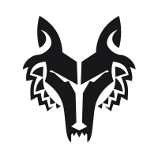

<p align="center">
  
</p>

<h1 align="center">The Wolf</h1>
<p align="center"><strong>The self-hosted application security &amp; code-quality platform that hunts, prioritizes, and <em>fixes</em> — across your entire fleet.</strong></p>
<p align="center">by <a href="https://alphabravo.io">AlphaBravo</a></p>

<p align="center">
  
  
  
  
  
  
</p>

---

> **One platform. Every scanner. Your infrastructure.**
>
> The Wolf unifies **49 best-in-class security and quality scanners** behind a single console, API, and CLI — then goes further than any point tool: it manages your whole **fleet** of repositories, scores and prioritizes what actually matters, and uses **AI to write and ship the fix**. No per-seat licensing. No code leaving your perimeter. No forty tools to install and babysit. Just Docker, and a platform that runs entirely on your terms.

---

## Why teams choose The Wolf

Security tooling sprawl is the problem. Every team ends up juggling a dozen scanners, each with its own CLI, output format, container, update cadence, and dashboard — and *none* of them tell you which of the 4,000 findings to fix first, or fix it for you.

The Wolf collapses that sprawl into one platform:

| The old way | With The Wolf |
|---|---|
| 12 scanners, 12 CLIs, 12 dashboards | **One console, one API, one CLI** |
| "Install bandit, gosec, eslint, trivy…" on every box | **Zero host install** — every tool runs in an isolated container |
| A wall of 4,000 undifferentiated findings | **Composite severity scoring** + AI prioritization |
| Findings you have to fix by hand | **AI fix engine** opens the PR for you |
| Per-repo tools that can't see the forest | **Fleet posture** across 100+ repos on any host |
| SaaS that ingests your source | **Self-hosted** — your data never leaves |
| Per-developer seat pricing | **No seat tax** |

---

## The platform at a glance

<table>
<tr>
<td width="33%" valign="top">

### 🐺 Unified Scanning

**49 scanners, one engine.** SAST, SCA, secrets, containers, IaC, DAST, SBOM, license, privacy/PII, K8s, and more — running in parallel, version-pinned, and fully reproducible.

</td>
<td width="33%" valign="top">

### 🛰️ Fleet Management

**See and steer everything.** Manage 100+ repos across local, GitHub, and remote SSH hosts from a single fleet dashboard — posture, trends, top risks, and what needs attention today.

</td>
<td width="33%" valign="top">

### 🤖 AI Remediation

**Find *and* fix.** AI enriches findings with ready-to-ship guidance, opens fix PRs, and runs autonomous scan→fix→rescan loops with budget and regression guardrails.

</td>
</tr>
<tr>
<td width="33%" valign="top">

### 🛡️ Governance & Policy

**Ship with confidence.** Quality gates that block CI, baselines that surface only what's *new*, audit-logged suppressions, and SARIF in and out of every system you already run.

</td>
<td width="33%" valign="top">

### 🔌 Built for Platforms

**Automate all of it.** A complete REST API with live OpenAPI docs, a CLI that mirrors it 1:1, scoped tokens, SSE streaming, SQLite or PostgreSQL — self-hosted and air-gap friendly.

</td>
<td width="33%" valign="top">

### 🔗 Source Anywhere

**Scan it wherever it lives.** Local checkouts, public and private GitHub, generic git, or code sitting on remote SSH hosts — no agents to deploy, bulk-imported in seconds.

</td>
</tr>
</table>

---

## Capabilities

### 🐺 One platform, every scanner

The Wolf orchestrates **49 industry-standard tools** across every major category — and it doesn't ask you to install a single one. Each tool runs in its own short-lived, locked-down container; the only thing on your host is Docker.

- **Comprehensive coverage** — SAST, software composition analysis (SCA), secret detection, container & image hardening, infrastructure-as-code, Kubernetes, policy-as-code, DAST, SBOM generation, license compliance, privacy/PII data-flow, dependency freshness, repository hygiene, and per-language linting for Python, Go, JavaScript/TypeScript, Java, Kotlin, Ruby, PHP, Rust, C/C++, Swift, and more.
- **Parallel by design** — every applicable tool runs concurrently with configurable concurrency, so a full multi-tool scan finishes in the time of your slowest scanner, not the sum of all of them.
- **Reproducible & auditable** — every tool is version-pinned. Identical scans on two hosts produce identical findings. Reproducibility you can put in front of an auditor.
- **Hardened isolation** — scanned code runs unprivileged, on a read-only mount, with a read-only root filesystem and no inbound network. Your scanners never become your attack surface.
- **Smart deduplication & scoring** — findings from overlapping tools are merged, fingerprinted, and ranked by a composite severity score (tool severity × code location × AI context), so the critical handful rises to the top of the noise.

### 🛰️ Fleet management & posture

Built for the reality of modern engineering orgs: dozens or hundreds of services, spread across laptops, build hosts, and Git providers.

- **The Fleet dashboard** — open findings by severity with week-over-week trend, your most vulnerable shared components ("14 repos still depend on log4j 1.2"), a prioritized *needs-attention* list (failing gates, stale scans, new criticals), and a live inventory by source, collection, and language.
- **Org-wide visibility** — flip on Fleet Mode and the whole organization shares one view of every repo, scan, and finding — governed by role and scope, not siloed per user.
- **Bulk onboarding** — import an entire GitHub organization in one flow, or point at an SSH host and auto-discover every git repository on it. Go from zero to a fully-mapped fleet in minutes.
- **Collections** — group repositories by team, environment, or tier; scan them as a batch and track cross-repo metrics and posture per collection.
- **Branch-aware trends** — track findings per branch over time and prove your security posture is improving.

### 🤖 AI-assisted remediation

Most tools tell you what's wrong. The Wolf fixes it.

- **Finding enrichment** — every finding can be enriched with an AI-authored, ready-to-hand-off remediation prompt: what's wrong, why it matters, and exactly how to fix it.
- **Automated fix engine** — point it at a finding or a whole scan and it generates the patch and opens the pull request, driven by your choice of agent (Claude Code, Codex, or a custom engine).
- **Autonomous remediation loops** — run scan → fix → rescan cycles that iterate until clean, governed by per-finding budgets, wall-clock and cost ceilings, and regression guardrails so a fix never makes things worse.
- **AI triage** — automatically separate real issues from false positives before they ever reach a human queue.
- **Your model, your keys, your call** — pluggable providers (Anthropic, OpenAI), and **AI is off by default** — a single master switch, opt-in when you're ready, with full cost and token accounting.

### 🛡️ Governance, compliance & policy

The controls that turn scanning into a program.

- **Quality gates** — declarative, scoped policies that fail a build on severity counts, new findings, or category thresholds. One CLI exit code wires The Wolf into any CI system.
- **Baselines & diff** — pin a known-good scan as a baseline and surface only what's `new`, `resurfaced`, or `fixed` — so developers see *their* regressions, not the backlog.
- **Durable suppressions** — audit-logged, expiring, scoped hide rules (by fingerprint, rule, category, or path) plus `.wolfignore` support — accepted risk that's tracked, not lost.
- **SARIF in and out** — import findings from any external scanner and export any scan as SARIF for your dashboards, code-scanning views, and compliance pipelines.
- **Complete audit trail** — every mutating action — who, what token, which resource, what result — is recorded for security review of both human and AI-driven activity.

### 🔌 Built for platform & security teams

- **A complete REST API** — every capability is an endpoint, documented with live, interactive OpenAPI/Swagger docs served right from the product (fully offline). If a human can do it in the UI, a pipeline can do it through the API.
- **A CLI that mirrors the API 1:1** — `wolf <resource> <verb>` for everything, with table output for humans and JSON for machines, kubeconfig-style contexts for multiple environments, and CI-friendly exit codes.
- **Scoped, revocable credentials** — least-privilege API tokens with `verb:resource` scopes and configurable expiry, alongside session-based UI auth — role-appropriate access for every actor.
- **Run it your way** — single-binary or Docker, SQLite for a team or **PostgreSQL** for the enterprise, on your servers, in your cloud, or fully **air-gapped**.
- **Live everything** — real-time scan, fix, and loop progress streamed over SSE to the console and the CLI.
- **Self-managed scanner images** — rebuild and publish your own scanner images directly from the console with streamed build logs; no external registry dependency required to run.

### 🔗 Scan code wherever it lives

- **Local paths** — point at any checkout on the host.
- **GitHub, public and private** — token-authenticated, with whole-org bulk import.
- **Generic git** — any HTTPS or SSH git remote.
- **Remote SSH hosts** — scan code sitting on other machines with no agent to install: The Wolf archives the working tree over SSH and scans it locally.

---

## What you get

- **Faster mean-time-to-remediate** — prioritized findings plus AI that opens the fix PR.
- **One pane of glass** — fleet-wide posture instead of a dozen disconnected dashboards.
- **Lower tooling cost** — replace a stack of point products and per-seat SaaS with one self-hosted platform.
- **Audit-ready evidence** — reproducible scans, a classified audit log, and SARIF exports out of the box.
- **Secure by default** — role-based access, two-factor auth, scoped API keys, and HTTPS via the bundled proxy.
- **No vendor lock-in** — your data, your infrastructure, standard formats, open scanners.

---

## Get started in 60 seconds

The only prerequisite is **Docker**. No scanners to install — they're pulled or built on demand.

```bash
# Launch the platform (API + web console)
docker compose up -d

# Open the console
open http://localhost:8778

# (optional) Pre-pull every scanner image
docker compose exec wolf wolf pull scanners

# Health-check the environment
docker compose exec wolf wolf doctor

# Scan a repository
docker compose exec wolf wolf scan --repo /repos/myproject
```

Prefer the API or CI? Everything the console does is one call away:

```bash
# Authenticate once, then drive the whole platform from the CLI.
# Mint a scoped key in the console (Account → API Keys) or:  wolf auth token create --name ci --scope read-write
wolf config set-context prod --server https://wolf.internal --token wolf_…
# (interactive alternative — prompts for a 2FA code when enabled)
#   wolf auth login --server https://wolf.internal --email you@example.com

wolf repo create --name acme --type github --path acme/payments
SCAN=$(wolf scan create --repo <repo-id> -o json | jq -r .data.id)
wolf scan watch "$SCAN"                       # live progress
wolf scan gate "$SCAN" --fail-exit-code       # block the pipeline on policy
wolf sarif export "$SCAN" > findings.sarif    # feed your dashboards
```

Interactive API docs ship with the product at **`/api/v1/docs`** (Swagger UI) and **`/api/v1/docs/redoc`** — no internet required.
For durable remote scans from CI or another service—including one-shot Git/SSH
sources, credentials, idempotency, SSE replay, workers, and Kubernetes native
Jobs—see **[`docs/remote-scanning-api.md`](docs/remote-scanning-api.md)**.
For the independently scheduled scanner image/toolchain supply chain—including
daily discovery, configurable weekly complete-set rebuilds, a seven-day
maximum stable-image age, on-demand operations, immutable releases, canary
rollout, and rollback—see
**[`docs/scanner-release-management.md`](docs/scanner-release-management.md)**.

---

## The scanner catalog

**49 scanners. One console.** Every tool is either pulled from its maintainer's official image (🌐), bundled in The Wolf's slim default image (📦), or available in an opt-in heavyweight bucket (🔧) — all orchestrated identically.

### Cross-language & security

| Category | Tool | Source | What it does |
|---|---|---|---|
| **SAST** | Semgrep | 🌐 | Pattern + semantic static analysis across every language |
| **SAST** | CodeQL | 🔧 | GitHub's semantic SAST engine |
| **SCA** | Trivy | 🌐 | Filesystem, container & IaC vulnerability scanning |
| **SCA** | Grype + Syft | 🌐 | SBOM-driven vulnerability matching |
| **SCA** | OSV-Scanner | 🌐 | Multi-ecosystem scanning on Google's OSV database |
| **Dependency freshness** | Renovate | 🌐 | Flags outdated & vulnerable deps across 15+ ecosystems |
| **IaC** | KICS | 🌐 | ~3k rules across Terraform, K8s, CloudFormation, Ansible, Helm |
| **IaC** | Checkov | 🌐 | Terraform / Helm / K8s / CloudFormation security |
| **Policy-as-code** | Conftest | 🌐 | OPA/Rego policy evaluation over any config |
| **Kubernetes** | Kubescape · Kube-linter · Pluto | 🌐 | Security, compliance & deprecated-API detection |
| **Secrets** | Gitleaks · TruffleHog · detect-secrets | 🌐 📦 | History + working-tree secret detection, with live verification |
| **Containers** | Hadolint · Dockle | 🌐 | Dockerfile linting & CIS image hardening |
| **Infrastructure** | TFLint | 🌐 | Provider-aware Terraform linting |
| **DAST** | Nuclei | 🌐 | Template-based HTTP/DNS/TCP vulnerability scanning |
| **Privacy / PII** | Bearer | 🌐 | GDPR/HIPAA/PCI data-flow analysis |
| **Repo hygiene** | OpenSSF Scorecard | 🌐 | Supply-chain security posture scoring |
| **SBOM** | Syft | 🌐 | Software bill-of-materials generation |
| **Docs / API** | Spectral · Vale | 🌐 | OpenAPI/AsyncAPI linting & prose style |
| **Shell / SQL / Config** | ShellCheck · SQLFluff · yamllint · markdownlint | 📦 | Language-specific linting |

### Per-language depth

| Language | Tools |
|---|---|
| **Python** | Bandit · Ruff · Mypy · pip-audit · Radon · Vulture |
| **Go** | Gosec · Staticcheck · Govulncheck · GoKart |
| **JavaScript / TypeScript** | ESLint · npm-audit |
| **Java / Kotlin** | detekt · PMD · Infer |
| **Ruby** | Brakeman · RuboCop |
| **PHP** | PHPStan |
| **Rust** | Clippy |
| **C / C++** | Cppcheck · Infer |
| **Swift** | SwiftLint |

The Wolf also maps source to tests across **13 languages** for coverage-aware scoring, and adds new tools with a single plugin file. The full annotated manifest lives in [`scanners/tools.yaml`](scanners/tools.yaml) and [`scanners/TOOLS.md`](scanners/TOOLS.md).

---

## Autonomous remediation

The Wolf can go past *finding* a problem to *proposing the fix* — autonomously, but on a short leash. The autonomous fix engine takes a single finding, has an AI coding agent write a patch, **proves the patch is good**, and hands you a review-ready branch and diff. It never trusts the agent's word for it. Architecture and rationale: [`docs/superpowers/specs/2026-06-15-autonomous-fix-engine-design.md`](docs/superpowers/specs/2026-06-15-autonomous-fix-engine-design.md).

**Off by default.** The entire surface is gated behind one master setting, `autofix_enabled` (default **`false`**). With it off, the execute path returns `403 autofix_disabled`, the worker processes nothing, and the UI surface is dark. Flip it on in **Settings → General** or with `wolf settings set autofix_enabled true`.

**v1 is dry-run, per-finding, verified, branch-only.** No push. No PR. Your working tree is never touched — the worker operates in an isolated worktree/clone on a fresh fix branch and leaves the result as an artifact for a human to review and merge.

### The verify gate (why you can trust it)

The load-bearing principle is **never use an engine's self-report to decide success** — every fix is judged by the diff on disk and a verification gate, not by what the agent claims it did. A proposed fix is **rolled back** unless it clears every step:

1. **Files actually changed** — an empty or no-op diff fails.
2. **It still builds** — a language-aware build (`go build ./...`, `tsc --noEmit`, …), parse-only at minimum.
3. **The finding is gone** — a **targeted rescan** re-runs *only* that finding's scanner/rule against the changed file and confirms it no longer fires.
4. **No regressions** — the rescan introduces no new findings.
5. **Optional tests** — a configured test command, if you supply one.

Anything that fails is rolled back and the orchestrator escalates (more context, then the next engine) up to a bounded `max_attempts`, all under per-finding, wall-clock, and cost budgets. A finding that can't be fixed cleanly is recorded as `unfixable` — not silently "done".

### The worker

The server **runs no agents**. It enqueues durable jobs onto a `fix_jobs` queue; a separable **`wolf fixer`** worker atomically claims them, runs the orchestration inside an engine container, streams logs + status back over SSE, and updates the job. Run one or many — the atomic claim guarantees two workers never double-claim a job, and a heartbeat + stale-reclaim recovers jobs from a crashed worker.

```bash
wolf fixer            # long-running worker: claim → fix → repeat
wolf fixer --once     # claim exactly one job, then exit (k8s Job-per-task)
```

### The engine containers

The worker runs inside one of three independently versioned **engine containers**, built and pushed through the same scanner-image build subsystem as the scanner images (see [`internal/scannerbuild`](internal/scannerbuild) `FixerVariants` and [`fixer/`](fixer/)). All share a base with `git`, `gh`/`glab`, and the language build tools the verify gate needs (`go`, `node`/`tsc`):

| Image | Engine | Auth |
|---|---|---|
| `wolf-fixer-claude` | Anthropic **Claude Code** CLI | one-time interactive `claude login` (session persisted) |
| `wolf-fixer-codex`  | OpenAI **Codex** CLI | one-time interactive `codex login` (session persisted) |
| `wolf-fixer-api`    | **API** engine via `internal/ai` — CLI-free | none; uses a provider key from the secret store |

The engine chain prefers an available, **authenticated** CLI and falls back to the API engine otherwise. The API engine returns a unified diff that wolf applies with `git apply` — it never edits files in place.

### Auth-then-ready flow

The CLI variants need a **one-time interactive login**; the API variant is the zero-auth fallback for environments where you can't provision a CLI session.

```bash
# 1. Start the worker container with a volume for the agent session.
# Resolve the approved release once and use its immutable digest here.
export WOLF_FIXER_IMAGE='docker.io/alphabravodevops/wolf-fixer-claude@sha256:<approved-digest>'
docker run -d --name wolf-fixer \
  -v wolf-fixer-session:/home/wolf/.config \
  -e WOLF_API_URL=https://wolf.internal \
  "$WOLF_FIXER_IMAGE"

# 2. Authenticate once — interactively — into that volume.
docker exec -it wolf-fixer claude login    # opens an auth URL; paste the token

# 3. The session now lives on the volume; restarts come up "ready" with no re-auth.
```

### Kubernetes shape

Two supported shapes — persist the agent session on a **PVC** mounted at `/home/wolf/.config`:

- **Deployment + PVC** — a long-running worker (or a few) that loop on the queue. Authenticate once with `kubectl exec -it deploy/wolf-fixer -- claude login`; the PVC keeps the session across rollouts.
- **Job-per-task** — `wolf fixer --once` as a Kubernetes `Job` that claims one job and exits, scaled by the queue depth. Pair the CLI variants with the same session PVC, or use `wolf-fixer-api` (no session needed) for fully ephemeral runs.

---

## Enterprise & deployment

The Wolf is designed to live inside your perimeter and your governance model.

| | |
|---|---|
| **Deployment** | Single Go binary or Docker Compose. Runs on your servers, your cloud, or fully air-gapped. |
| **Data store** | SQLite for a team; **PostgreSQL** for scale and high availability. |
| **Access control** | **Role-based** (admin / user) with per-user data isolation, **two-factor auth** (TOTP, optionally mandatory org-wide), console sessions, and scoped, revocable **API keys** (`verb:resource` + `admin`). See [`docs/authentication.md`](docs/authentication.md). |
| **Audit** | A **classified, security-aware audit log** — semantic event type, category, severity, actor, source IP, and result — searchable and filterable. See [`docs/audit.md`](docs/audit.md). |
| **HTTPS** | Run behind the bundled **Caddy** reverse proxy — automatic Let's Encrypt *or* bring-your-own cert — with an optional hardened Docker-socket proxy. See [`docs/deployment.md`](docs/deployment.md). |
| **Secrets** | Encrypted at rest with a master key; GitHub, SSH, AI-provider, and registry credentials managed in-product. |
| **Air-gapped** | Pre-load images and run with `pull_policy=Never`, or disable upstream images entirely and run everything from images you build and host yourself. |
| **Supply chain** | Version-pinned, reproducible scanner images you can build, sign, and publish from the console to your own registry. |
| **Data residency** | Self-hosted by design — source code and findings never leave your infrastructure. |

The scanner backend is a **three-tier image strategy** — official upstream images where maintainers publish them, a slim Wolf-built image for the long tail of per-language tools, and opt-in heavyweight buckets (JVM, Rust, CodeQL) pulled only when needed — so a typical Python + JavaScript shop runs on **well under a gigabyte** of images.

For the full operations reference — air-gapped installs, network allowlists, registry mirroring, scanner DB caching, and the `WOLF_SCANNERS_*` knobs — see [`scanners/README.md`](scanners/README.md) and [`docs/`](docs/).

---

## Architecture

```text
cmd/wolf/        CLI + server entrypoint
internal/
  api/           HTTP API, OpenAPI docs, SSE streaming, auth & audit middleware
  ai/            Pluggable AI providers (Anthropic, OpenAI)
  auth/          Sessions, scoped API tokens, RBAC
  db/            SQLite + PostgreSQL persistence
  fix/  loop/    AI fix engine, autonomous remediation loops + fix worker/orchestrator
  finding/       Identity, diff, baselines, quality gates, suppressions, SARIF
  scan/          Detection, orchestration, scoring, reporting
  scannerbuild/  Server-side scanner & fixer image build & publish
  setup/scanners/ Container backend
plugins/         49 tool plugins, by language/category
scanners/        Wolf-built scanner images + manifests
fixer/           Autonomous-fix engine container images (claude / codex / api)
ui/              Vite + React 19 + Tailwind 4 console
```

A single Go binary serves the API, the web console, and the embedded documentation; the only runtime dependency is Docker for the scanner containers.

---

## License

Proprietary. Copyright © AlphaBravo, Inc. All rights reserved.

<p align="center"><sub>The Wolf — built by <a href="https://alphabravo.io">AlphaBravo</a>.</sub></p>
