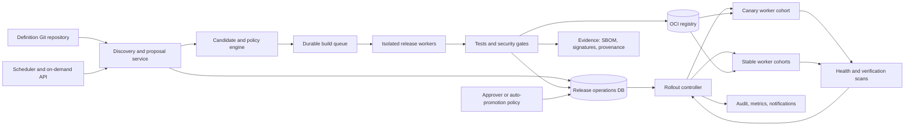

[PRD]

# Scanner Release Management Platform

## Complete implementation plan

**Status:** Complete-product repository implementation complete; listed full-matrix, credentialed, customer, production-like, and independent-review qualifications remain  
**Date:** 2026-07-30  
**Owners:** Platform Engineering, Security Engineering, Product Engineering, SRE  
**Applies to:** Wolf API, workers, CLI, web UI, scanner build system, CI/CD, Docker Compose, Kubernetes, private registries, and air-gapped deployments  
**Related documents:**

- `docs/superpowers/specs/2026-06-12-scanner-toolchain-management-plan.md`
- `docs/superpowers/plans/2026-06-13-scanner-image-build-push.md`
- `docs/superpowers/plans/2026-07-30-remote-code-scanning-api-workers-plan.md`

This plan extends the existing scanner toolchain and image-build work. Where an older document permits mutable runtime tags, synchronous builds, or Docker Hub-only behavior, this document takes precedence.

### Implementation status convention

Checked tasks below have code, tests, or checked-in operational documentation
in this repository. Unchecked tasks are deliberately not being represented as
complete merely because an interface or build-plan step exists. In particular,
real multi-architecture publication, customer registry/KMS integration,
production-like Kubernetes/Compose rollout drills, browser/visual review,
notification delivery, and measured disaster-recovery exercises require
deployment infrastructure and recorded qualification evidence.

### Complete-product scope; not an MVP

This is the implementation contract for the entire scanner release-management
product. It is not a “first version,” MVP, proof of concept, or UI-only
facade. The numbered phases describe dependency order and safe enablement; they
do not define separately shippable reduced products. A capability is not done
until its production path, authorization, persistence, failure behavior,
observability, documentation, and required validation are done.

In particular, completion includes all of the following in one coherent
platform:

- scheduled and on-demand discovery, selected updates, complete rebuilds, and
  emergency rebuilds;
- all four owned scanner images and all four owned fixer images, with their
  dependency order and supported architectures;
- managed GitHub/GHCR publication, verified Docker Hub mirroring,
  customer-managed registries and signing, and air-gapped export/import;
- immutable publication receipts, approvals, signatures, provenance, SBOMs,
  policy evidence, canary rollout, automatic rollback, and revocation;
- the complete enterprise UI for viewers, operators, approvers,
  administrators, and auditors, including read-only states and durable
  operation recovery; and
- preservation of existing scan creation, scan execution, tool inventory,
  image operations, custom builds, and troubleshooting workflows.

Feature modes are rollout controls for safely activating the complete system.
They are not permission to omit a required capability from the definition of
done. No unchecked implementation or qualification item may be silently
reclassified as post-launch follow-up.

---

## 1. Executive summary

Wolf will gain an enterprise scanner release-management platform that continuously discovers scanner updates, creates reviewable release candidates, builds and tests the complete scanner set, produces signed and attestable immutable artifacts, promotes approved releases, and safely rolls those releases through scanner workers.

The platform supports two equally valid operating models:

1. **Managed release factory:** Alpha Bravo builds, signs, tests, and publishes trusted scanner releases. Wolf installations consume a selected release through GHCR by default, with Docker Hub as a verified mirror.
2. **Customer-managed release factory:** Customers build the same release definition into a private registry or an air-gapped bundle, sign it with their own trust root, and use the same policy, approval, rollout, observability, and rollback flows.

The operational cadence is:

- Discover available tool, upstream image, base image, and toolchain updates every day.
- Create a complete scanner-set candidate every week.
- Allow authorized on-demand discovery, selected-tool updates, full rebuilds, security rebuilds, retries, promotion, and rollback.
- Default to human approval before promotion.
- Permit policy-gated automatic promotion for explicitly allowed low-risk changes after every mandatory gate passes.
- Roll out to a canary worker cohort, verify real scans and operational health, then proceed to stable workers.
- Automatically roll back when configured failure thresholds are crossed.

The existing scan API and UI remain functional throughout the migration. A scan always records and uses one immutable scanner release snapshot; an update can never replace an image underneath an active scan.

---

## 2. Why this design

### 2.1 The current system is useful but incomplete

The repository already has strong building blocks:

- `scanners/tools.yaml` describes scanner versions, update sources, image ownership, and integration tiers.
- `scanners/versions.env` supplies build-time pins and has an embedded counterpart for local builds.
- `cmd/scannertools` validates definitions, checks upstream versions, and applies version bumps.
- `.github/workflows/scanners-image.yml` validates, builds, smoke-tests, scans, and publishes scanner variants on source changes and manual dispatch.
- The API and settings UI can check tool versions, inspect images, pull images, and run scanner builds.
- Docker Compose and Helm can run the scanner images.
- Wolf already has audit logging, API authorization, persisted version-check cache records, and durable remote-scan queue patterns.

The gaps are operational and supply-chain gaps:

- No scheduled image update or rebuild workflow exists.
- A version check refreshes cache state but does not create a controlled update proposal.
- In-app builds are tied to an HTTP/SSE request and are not durable jobs.
- Build history, approvals, retries, cancellation, and state transitions are not persisted.
- A build can move a runtime version tag and `latest`, so a tag is not a trustworthy immutable release identity.
- The active build version can be reserved before publication succeeds.
- The API process may require direct Docker access.
- Image signatures, SBOMs, provenance, license policy, and mirror verification are not a complete release gate.
- Scanner updates are not rolled through canary and stable worker cohorts.
- The UI does not provide an update inbox, candidate diff, policy editor, approval record, release history, rollout timeline, or rollback workflow.
- The embedded build context in the Wolf binary is not an appropriate source of truth for a continuously updated release factory.

### 2.2 Core reasoning

The platform separates four concerns:

1. **Definition:** Git stores the reviewable scanner manifest, pins, build inputs, and generated release lock.
2. **Operation:** The database stores discovery runs, candidates, build steps, approvals, published releases, rollouts, observed worker state, events, and audit history.
3. **Artifact:** OCI registries store immutable images and related SBOM, signature, provenance, and release-manifest artifacts.
4. **Deployment:** Wolf stores a desired release ID and assigns its immutable digest snapshot to workers and scans.

This separation provides:

- Reproducibility without treating a mutable database row as source code.
- Durable operation without treating a GitHub Actions log as the product database.
- Immutability without removing convenient `candidate` and `stable` channel aliases.
- Safe rollout without coupling scanner releases to Wolf application releases.
- A uniform model for managed cloud, private registry, Compose, Kubernetes, and air-gapped environments.

---

## 3. Decisions

These decisions are part of the product contract.

| Area | Decision | Reasoning |
|---|---|---|
| Build ownership | Managed central factory and customer-managed factory are both supported | Enterprises need a trusted default and sovereign operation |
| Source of truth | Git for definitions and lockfiles; release DB for operational state | Makes pin changes reviewable while retaining durable workflows |
| Discovery cadence | Daily, configurable by organization timezone | Finds security and compatibility updates promptly |
| Candidate cadence | Weekly, configurable, plus on-demand | Balances freshness and operational stability |
| Promotion | Approval by default; configurable policy-gated automatic promotion | Supports separation of duties without preventing safe automation |
| Quality | Full enterprise gate suite is mandatory | A version being newer is not evidence that its output is compatible or safe |
| Release identity | Scanner release sequence independent from Wolf version | Scanner freshness should not require an application release |
| Runtime reference | Immutable digest snapshot | Prevents tag drift and mid-scan changes |
| Rollout | Canary, verification, staged stable rollout, automatic rollback | Limits blast radius |
| Registry | GHCR primary managed registry; Docker Hub mirror; custom registries supported | Matches current reliable publication path and enterprise deployment needs |
| Scheduling | Database-backed leases and idempotency | Works across replicas without duplicate weekly releases |
| Build execution | Durable isolated release workers, not the API process | Improves reliability and removes unnecessary Docker socket exposure |
| UI compatibility | Existing inventory, scan, and troubleshooting capabilities remain available | Scanner release management must not regress normal Wolf use |
| Air gap | Signed export/import bundle with offline verification | Air-gapped operation must retain the same trust and audit properties |

### 3.1 Default schedule

Defaults are configuration, not hard-coded policy:

- Daily discovery: `02:00` in the configured organization timezone with up to 20 minutes of deterministic jitter.
- Weekly complete-set candidate: Sunday at `03:00` in the configured
  organization timezone. It evaluates and, when rebuild policy is due, builds
  all eight owned images rather than only the tools whose version strings
  changed.
- Maximum stable-image age: seven days by default. A weekly rebuild is required
  when base-image, OS-package snapshot, toolchain, downloaded artifact, build
  policy, or security evidence changed, or when the stable release exceeds the
  configured maximum age. Identical verified inputs may produce an audited
  no-op instead of a duplicate release.
- Security advisory discovery: may enqueue immediately, independent of the weekly candidate window.
- On-demand operations: complete discovery, selected-component discovery,
  selected candidate, complete-set rebuild, security rebuild, exact-step
  retry, mirror reconciliation, and rollback.
- Rollout: constrained to the configured maintenance window unless an authorized emergency override is recorded.
- Missed schedules: run once after recovery if still within a configurable catch-up window; never enqueue every missed interval.

---

## 4. Goals

- Keep every supported scanner, upstream scanner image, build base, and toolchain visibly current.
- Turn update discovery into an actionable and auditable release workflow.
- Build the complete scanner set reproducibly for every supported architecture.
- Verify scanner invocation, output parsing, finding normalization, security posture, licensing, and performance before promotion.
- Publish signed images, SBOMs, provenance, checksums, and a signed release manifest.
- Support managed registries, private registries, mirrors, and offline bundles.
- Allow scheduled and on-demand operations through API, CLI, and UI.
- Preserve existing UI and scan behavior while adding the release-management experience.
- Pin every scan to a release and image digest set for reproducible results.
- Roll out changes gradually and make rollback fast, safe, and visible.
- Produce sufficient audit and telemetry data for enterprise operations and compliance.

## 5. Non-goals

- Allowing arbitrary Dockerfiles or untrusted build scripts through the administrative API.
- Automatically accepting major-version scanner behavior changes without a compatible parser and explicit policy.
- Bypassing mandatory security, signature, architecture, or parser gates.
- Replacing a customer’s registry, KMS, Git provider, or enterprise scheduler.
- Coupling scanner releases to billing or a public scanner marketplace.
- Guaranteeing that third-party tools never introduce finding changes; the platform detects, classifies, and governs those changes.
- Retrofitting live scans to a newly promoted release.

---

## 6. Success metrics

### 6.1 Freshness

- 100% of registered scanner definitions have a valid update-source strategy or a documented manual-update exception.
- Daily discovery completes within its configured service-level objective.
- Supported low-risk patch updates reach a release candidate within seven days.
- Critical scanner or base-image fixes can be discovered, built, approved, and canaried on demand.

### 6.2 Reliability

- 100% of published releases have an immutable release manifest and digest for every required artifact.
- 100% of promoted releases pass required smoke, parser, security, license, SBOM, signature, and provenance gates.
- Duplicate schedules never create duplicate candidates for the same definition revision and schedule period.
- An interrupted API process does not interrupt a running build or rollout.
- Rollback restores the last known-good release within the configured operational objective.

### 6.3 Compatibility

- Existing scan routes, settings inventory, image inspection, and scanner execution continue to work during migration.
- A scanner rollout never changes the image digest assigned to an active scan.
- Compose, Kubernetes, SQLite, and PostgreSQL paths pass end-to-end validation.
- UI browser tests cover update, approval, rollout, failure, and rollback flows.

### 6.4 Security and compliance

- Every managed release is signed and has verifiable provenance and SBOMs.
- Registry, Git, signing, and notification secrets are redacted from events, logs, audit details, and build output.
- Approval and emergency-override actions are attributable and immutable in audit history.
- Vulnerability and license exceptions require owner, reason, scope, and expiration.

---

## 7. Personas and authorization

| Role | Capabilities |
|---|---|
| Viewer | View freshness, candidates, releases, rollouts, artifacts, and audit-safe logs |
| Scanner operator | Run discovery, create allowed candidates, retry jobs, pause/resume rollouts |
| Release approver | Approve or reject candidates and record exceptions |
| Registry administrator | Configure registry targets, mirrors, credentials, and trust roots |
| Supply-chain administrator | Configure schedules, policy, builders, signing, retention, emergency overrides, and revocation |
| Auditor | Read immutable approvals, evidence, provenance, release and rollout history |

API scopes:

- `read:scanner-supply-chain`
- `operate:scanner-supply-chain`
- `approve:scanner-releases`
- `manage:scanner-registries`
- `admin:scanner-supply-chain`

Optional separation-of-duties policy:

- The actor who creates or modifies a candidate cannot be its only approver.
- A release with an exception requires a distinct approver.
- Emergency override requires a reason and an actor with `admin:scanner-supply-chain`.
- Service identities can auto-promote only within an explicitly assigned policy.

---

## 8. Terminology

- **Definition revision:** Git commit containing scanner definitions and build inputs.
- **Discovery run:** A durable check of every configured update source.
- **Update item:** One proposed tool, image, base, package, or toolchain change.
- **Candidate:** A proposed scanner-set lock and its accumulated build/test evidence.
- **Scanner release:** A signed immutable set of scanner artifacts with an independent release ID.
- **Channel:** A movable pointer such as `candidate` or `stable`; never used directly by an active scan.
- **Release manifest:** Signed OCI artifact listing exact digests and metadata for the complete release.
- **Target:** A Wolf deployment or worker cohort that can receive a release.
- **Rollout:** The stateful process that changes a target’s desired scanner release.
- **Observed release:** Release digest set currently reported by a worker.
- **Release factory:** Scheduler, orchestrator, workers, policy engine, and artifact publisher.

---

## 9. Target architecture



### 9.1 Components

1. **Release API**
   - Validates commands and permissions.
   - Creates durable operations.
   - Returns `202 Accepted` for long-running work.
   - Exposes resources, evidence, event streams, and audit references.
   - Never owns build-process lifetime.

2. **Scheduler**
   - Acquires a database lease per schedule and period.
   - Enqueues discovery, candidate, retention, reconciliation, and rollout work.
   - Supports timezone, jitter, maintenance windows, catch-up, and disabled state.

3. **Discovery engine**
   - Resolves all update-source types with bounded concurrency and rate limits.
   - Checks tool releases, upstream image digests, base images, language toolchains, downloaded archives, and OS package snapshots.
   - Stores raw evidence and normalized comparisons.

4. **Proposal engine**
   - Produces a deterministic manifest/lock diff.
   - Classifies risk and required gates.
   - Opens or updates a Git pull request when Git integration is configured.
   - Can export a signed patch proposal when direct Git writes are unavailable.

5. **Build orchestrator and workers**
   - Execute an immutable build plan from a definition revision and lock digest.
   - Isolate credentials and build workloads from the API.
   - Persist step transitions, heartbeats, output, artifacts, retries, and cancellation.
   - Support BuildKit and Kubernetes-native builders through one worker contract.

6. **Evidence and policy engine**
   - Evaluates all mandatory and conditional gates.
   - Stores compact results in the database and large evidence in artifact storage/OCI.
   - Explains every pass, block, warning, exception, and auto-promotion decision.

7. **Rollout controller**
   - Reconciles desired and observed releases.
   - Pins queued scans at assignment time and active scans at start time.
   - Handles canary, staged rollout, pause, verification, timeout, and rollback.

8. **UI and CLI**
   - Use the same public API.
   - Do not rely on browser-held build credentials.
   - Provide a full operational workflow and retain current troubleshooting actions.

---

## 10. Non-negotiable invariants

1. A release is immutable after publication.
2. A channel alias can move, but a scan resolves it once to a release ID and digest set.
3. A published release ID is never reused, even after revocation.
4. A build number or release sequence is finalized only after successful atomic publication.
5. Git changes define scanner inputs; the database records the operational workflow around them.
6. A candidate is uniquely identified by definition commit, lock digest, target platforms, and build-policy revision.
7. Every required image must exist on every required platform before publication.
8. Every managed image and release manifest must have a valid signature and provenance.
9. No promotion can bypass hard gates.
10. An exception is scoped, attributable, justified, and expiring.
11. Registry credentials and signing keys are never returned by read APIs.
12. Scanner release work is safe to retry and idempotent.
13. An active scan never changes release or digest.
14. Rollback changes desired release to a prior immutable release; it never rebuilds the prior release.
15. Existing UI and API behavior is preserved until an explicit compatibility deprecation is completed.

---

## 11. Release definition and identity

### 11.1 Git-managed files

The definition repository contains:

- `scanners/tools.yaml`
- `scanners/versions.env`
- `internal/scannerbuild/context/tools.yaml`
- `internal/scannerbuild/context/versions.env`
- Scanner Dockerfiles and scripts
- Build-base and package snapshot pins
- Parser compatibility declarations
- Representative scanner fixtures and expected normalized output
- `scanners/scanner-lock.yaml`, generated deterministically
- Generated scanner documentation/changelog fragments

Embedded build files remain parity-checked while the current local builder exists. Release workers build from a checked-out definition revision, not from the API binary’s embedded copy.

### 11.2 Release lock schema

`scanners/scanner-lock.yaml` is generated, canonicalized, and hashed. It includes:

```yaml
schemaVersion: wolf.scanners/v1
definitionCommit: 5f4a...
generatedAt: 2026-07-30T14:00:00Z
releaseInputs:
  platforms: [linux/amd64, linux/arm64]
  buildPolicyRevision: sha256:...
  sourceDateEpoch: 1785420000
baseImages:
  alpine:
    reference: docker.io/library/alpine@sha256:...
toolchains:
  go:
    version: 1.x.y
    archiveSha256: ...
tools:
  semgrep:
    version: x.y.z
    updateSource:
      type: pypi
      package: semgrep
    source:
      url: https://...
      sha256: ...
    integrationTier: wolf-image
upstreamImages:
  example:
    source: registry.example/tool@sha256:...
    mirrored: ghcr.io/alphabravocompany/...@sha256:...
packages:
  alpine:
    snapshot: ...
    resolved:
      - name: git
        version: ...
```

Rules:

- Stable YAML key ordering and normalized timestamps make generation deterministic.
- Mutable source tags are resolved to digests.
- Downloaded binaries and archives require cryptographic checksums.
- Base images use digests.
- OS package repositories use a snapshot or equivalent reproducible source.
- Tools that cannot be deterministically pinned carry an explicit policy status and cannot auto-promote.
- The lock digest is attached to images, provenance, candidate rows, and the release manifest.

### 11.3 Release naming

- Human-readable release ID: `scanner-set-YYYY.WW.N`, for example `scanner-set-2026.31.1`.
- Database ID: immutable UUID/ULID following repository conventions.
- OCI immutable tag: the release ID.
- OCI channel aliases: `candidate`, `stable`, and optional named rings.
- Images are consumed by digest even when an operator selects a channel.
- Release sequence reservation occurs transactionally at publication. Failed candidates retain candidate IDs but do not consume a published release ID.

### 11.4 Release contents

A release is complete only when it contains:

- Every required Wolf scanner image variant: `wolf-scanners`,
  `wolf-scanners-jvm`, `wolf-scanners-rust`, and `wolf-scanners-codeql`.
- Every required Wolf fixer image variant: `wolf-fixer`, `wolf-fixer-api`,
  `wolf-fixer-claude`, and `wolf-fixer-codex`; dependent fixer images bind to
  the exact published `wolf-fixer` base digest.
- Every supported platform for each variant.
- Mirrored or referenced upstream scanner images by digest.
- Bucket/download artifacts and checksums where relevant.
- Scanner parser/normalizer compatibility revision.
- Fixer images that share scanner runtime dependencies.
- Release manifest.
- Per-image and aggregate SBOMs.
- Signatures and provenance.
- Vulnerability and license evidence.
- Smoke and parser evidence.
- Approved, unexpired exceptions.

Required owned-image matrix:

| Image key | Artifact | Required platforms | Dependency |
|---|---|---|---|
| `default` | `wolf-scanners` | `linux/amd64`, `linux/arm64` | None |
| `jvm` | `wolf-scanners-jvm` | `linux/amd64`, `linux/arm64` | None |
| `rust` | `wolf-scanners-rust` | `linux/amd64`, `linux/arm64` | None |
| `codeql` | `wolf-scanners-codeql` | `linux/amd64` | Architecture-limited by policy |
| `fixer-base` | `wolf-fixer` | `linux/amd64`, `linux/arm64` | None; publish before engines |
| `fixer-api` | `wolf-fixer-api` | `linux/amd64`, `linux/arm64` | Exact `fixer-base` digest |
| `fixer-claude` | `wolf-fixer-claude` | `linux/amd64`, `linux/arm64` | Exact `fixer-base` digest |
| `fixer-codex` | `wolf-fixer-codex` | `linux/amd64`, `linux/arm64` | Exact `fixer-base` digest |

A platform may be added or removed only through a reviewed build-policy
revision. Discovery reporting, publication receipts, release manifests, UI
coverage, and validation all use this same matrix; CI job definitions are not
an independent source of truth.

---

## 12. Persistent data model

Migration numbers are provisional; implementation must select the next available numbers without rewriting existing migrations.

### 12.1 Tables

| Table | Purpose | Important fields and constraints |
|---|---|---|
| `scanner_update_policies` | Schedule, risk, approval, gate, rollout, retention settings | `id`, `scope`, `revision`, `enabled`, `schedule_json`, `rules_json`, `created_by`, timestamps; unique active scope/revision |
| `scanner_registry_targets` | Managed, mirror, private, and air-gap registry definitions | `id`, `name`, `registry_type`, `host`, `namespace`, secret reference, trust-policy reference, platform policy, enabled; unique host/namespace |
| `scanner_discovery_runs` | Durable discovery operations | `id`, trigger, schedule period, definition commit, policy revision, state, counts, timestamps, actor, idempotency key, error classification |
| `scanner_update_items` | Normalized proposed changes | run ID, component type/name, current value, available value, source evidence, risk class, compatibility flags, selected state |
| `scanner_release_candidates` | Proposed complete release locks | `id`, discovery ID, definition commit, proposed commit/PR, lock digest, risk summary, state, required gates, policy decision |
| `scanner_build_runs` | One candidate build attempt | candidate ID, attempt, worker ID, state, platforms, start/end, cancellation, error class; unique candidate/attempt |
| `scanner_build_steps` | Durable step-level evidence and logs | build ID, step key, state, attempt, timestamps, output URI, summary JSON; unique build/step/attempt |
| `scanner_releases` | Published immutable release set | ID, release name, candidate ID, lock digest, manifest digest, state, published time, signer, policy revision; immutable fields after publish |
| `scanner_release_tools` | Tool inventory within a release | release ID, tool key, version, source/digest/checksum, parser compatibility, metadata |
| `scanner_release_images` | Exact image digests and platforms | release ID, image key, registry target, repository, digest, platform digest map, size, signature status; unique release/image/registry |
| `scanner_release_artifacts` | SBOM, provenance, test evidence, reports | release ID/candidate ID, artifact type, media type, URI/digest, size, retention class |
| `scanner_release_approvals` | Approval, rejection, exception, emergency records | candidate/release ID, actor, action, reason, evidence digest, policy decision, expiration; append-only |
| `scanner_rollouts` | Desired release transition | ID, target, from/to release, strategy, state, policy snapshot, actor, timestamps, rollback reference |
| `scanner_rollout_cohorts` | Canary/stable cohort progress | rollout ID, cohort, desired/observed release, state, counts, health summary, deadline |
| `scanner_worker_release_status` | Worker-reported observed state | worker ID, cohort, desired release, observed release, cached digests, last heartbeat, verification state |
| `scanner_release_events` | Ordered operation event stream | aggregate type/ID, monotonic sequence, event type, redacted payload, timestamp; unique aggregate/sequence |
| `scanner_schedule_leases` | Scheduler coordination | schedule key, period key, owner, lease expiration, completion state; unique schedule/period |

### 12.2 Database rules

- Use repository-standard ID and timestamp types for SQLite and PostgreSQL.
- Add foreign keys and explicit deletion behavior.
- Published release records, approval records, and evidence digests are append-only.
- Candidate and rollout state transitions use optimistic concurrency/version columns.
- Events are written in the same transaction as their state transition.
- Large logs and evidence live in configured artifact storage; the DB stores digests, metadata, and access-controlled URIs.
- Store normalized error class separately from redacted human detail.
- Use partial or equivalent indexes for queued work, active rollouts, pending approval, and enabled schedules.
- Add retention jobs for transient logs and discovery evidence; never silently delete release identity, approval, or audit records.
- Make all mutation endpoints accept an idempotency key.
- Add repository tests that run identical state-transition cases against SQLite and PostgreSQL.

### 12.3 State machines

#### Discovery run

```text
queued -> resolving -> comparing -> proposing -> completed
   |          |            |            |
   +----------+------------+------------+-> failed
   +----------------------------------------> cancelled
```

#### Candidate

```text
draft -> awaiting_definition -> queued -> building -> testing
  -> security_review -> awaiting_approval -> approved -> publishing -> published
              |                 |               |
              +-> blocked       +-> rejected    +-> failed
```

#### Release

```text
published -> candidate_channel -> canary -> stable -> deprecated
                  |                |          |
                  +----------------+----------+-> revoked
```

Revocation does not delete artifacts. It prevents new assignment and triggers an operator-visible impact assessment.

#### Rollout

```text
pending -> preparing -> canary -> verifying -> rolling_out -> completed
              |           |          |              |
              +-----------+----------+--------------+-> failed
                          |          |
                          +-> paused |
                                     +-> rolling_back -> rolled_back
```

Transition requirements:

- Explicit allowed-transition map.
- Actor, policy revision, prior state, new state, and reason are persisted.
- Every command is idempotent.
- A stale state version returns `409 Conflict`.
- Cancellation is cooperative and has a terminal timeout.
- Worker loss requeues only safe, resumable steps.

---

## 13. Update discovery

### 13.1 Coverage

Every tool and artifact must declare one of:

- PyPI
- npm
- RubyGems
- Packagist
- Go modules
- GitHub releases
- GitHub tags
- OCI/Docker registry tag plus digest
- Rust channel/toolchain
- OS distribution package repository
- Direct archive with signed index/checksum
- Vendor advisory feed
- Manual with named owner, reason, and review date

The existing updater is expanded so unsupported source types do not silently appear current.

### 13.2 Discovery behavior

- Resolve sources concurrently with per-host limits and exponential backoff.
- Honor rate-limit headers and store next-safe-retry time.
- Cache source responses with ETag/Last-Modified when possible.
- Distinguish `current`, `update_available`, `source_unreachable`, `unsupported`, `held`, `yanked`, and `unknown`.
- Detect upstream tag digest changes even when version text is unchanged.
- Detect base-image digest changes.
- Detect OS package snapshot changes and patched rebuild opportunities.
- Detect tool EOL, archive disappearance, signature changes, license changes, and platform loss.
- Preserve raw response digests for audit without storing tokens or unnecessary response bodies.
- Permit selected-tool checks and complete checks.
- Return partial results when one source fails; overall status communicates incomplete coverage.
- Retry transient failures but never classify failure as “no update.”

### 13.3 Risk classification

Each update item is classified:

- **Low:** rebuild-only change, compatible base patch, scanner patch with stable output contract.
- **Medium:** scanner minor update, parser/ruleset change, dependency or license change.
- **High:** major update, command-line contract change, output schema change, platform loss, signing/source change, new privileged requirement.
- **Critical:** known actively exploited issue, revoked source/signature, compromised or removed artifact.

The classifier is deterministic and explainable. Policy can increase risk but cannot decrease a hard-coded critical classification without an explicit expiring exception.

### 13.4 Proposal behavior

- A discovery run never mutates production release state.
- Candidate creation selects update items and regenerates all parity files and documentation.
- A scheduled complete-set candidate evaluates all 49 registered tools, all
  four scanner images, all four fixer images, base images, OS packages,
  toolchains, downloaded artifacts, and upstream image digests. Partial source
  coverage cannot be reported as “current.”
- The proposal engine runs `scannertools` validation before opening a PR.
- One active proposal exists per definition branch and candidate key.
- Re-running discovery updates an existing bot proposal only when no human modifications would be overwritten.
- When direct Git integration is unavailable, provide a patch bundle and exact CLI command to apply it.
- A manually edited proposal must be rebuilt; prior evidence is invalidated when the lock digest changes.

---

## 14. Build and test pipeline

### 14.1 Execution contract

Create a `scanner-release-worker` process with a durable worker protocol:

- Claims a build step using a lease.
- Downloads/checks out the exact definition commit.
- Verifies the lock digest and policy revision.
- Uses an ephemeral workspace.
- Receives short-lived, least-privilege registry and artifact credentials.
- Emits structured progress events and redacted logs.
- Heartbeats while active.
- Supports cooperative cancellation.
- Publishes step result and evidence digest atomically.
- Cleans workspaces and credentials after completion.

Supported worker backends:

- BuildKit/buildx worker for managed and customer-owned builders.
- Kubernetes Job worker for isolated elastic execution.
- Local administrative worker for offline/single-node operation, clearly identified as customer-managed.

The API server does not require `/var/run/docker.sock`.

### 14.2 Required pipeline steps

1. Checkout and definition verification.
2. Manifest/schema validation.
3. Generated-file and embedded-context parity validation.
4. Update-source resolution recheck.
5. Lock reproducibility check.
6. License metadata validation.
7. Per-platform image builds.
8. Strict binary version smoke tests.
9. Scanner invocation smoke tests.
10. Representative parser fixture tests.
11. Reviewed scanner-family expectations and structural normalization tests.
12. Cross-release scan-corpus comparison.
13. Image vulnerability scans.
14. Secret and credential leakage scan.
15. License policy scan.
16. Per-image SBOM generation.
17. Aggregate release SBOM generation.
18. OCI annotation validation.
19. Provenance generation.
20. Candidate registry publication.
21. Signature creation and verification.
22. Multi-architecture manifest validation.
23. Mirror copy and digest verification.
24. Compose integration scan.
25. Kubernetes/Kind integration scan.
26. Release manifest generation and signing.
27. Policy evaluation.
28. Candidate evidence summary.

The final evidence-summary step emits a canonical publication receipt. The
receipt binds the candidate, build, exact proposed definition commit, lock
digest, policy snapshot and decision, complete 49-tool inventory, all eight
owned images, platform manifests, signatures, SBOMs, provenance, and evidence
artifacts. Its digest is recomputed by the trusted control plane. Approval and
publication bind that digest; clients can express intent but cannot supply an
authoritative release inventory.

### 14.3 Strict smoke tests

For every bundled scanner:

- The expected executable exists.
- `--version` or equivalent succeeds within a timeout.
- Parsed version exactly matches the lock.
- Running against a minimal supported project succeeds.
- Running against an intentionally vulnerable fixture returns expected output.
- The Wolf parser accepts the output.
- Normalized findings contain stable required fields.
- Tool output cannot escape the designated workspace.
- Tool failure and timeout produce a classified scanner-run result.

For upstream scanner images:

- Source digest is recorded.
- Mirror digest or manifest equivalence is verified.
- Expected entrypoint and version are checked.
- The image runs under Wolf’s current security options.
- Supported CPU architecture is verified.

### 14.4 Parser and finding regression gates

Maintain a versioned fixture corpus for each scanner or scanner family:

- Clean sample.
- Known vulnerable sample.
- Malformed/partial output sample.
- Large output sample.
- Path and encoding edge cases.
- Suppression/baseline case where supported.

Compare the candidate with the last stable release:

- Finding counts by severity and rule.
- Added/removed rule IDs.
- Changed path, line, message, fingerprint, and remediation fields.
- Parser warnings and dropped records.
- Exit codes and runtime.
- Memory and output-size changes.

Thresholds are scanner-specific. Any unexplained loss of expected findings, parser failure, or normalization contract violation is a hard block.

### 14.5 Vulnerability and license gates

- Scan final images, not only build layers.
- Refresh vulnerability databases before the gate and record database identity.
- Default block on fixable critical vulnerabilities and policy-defined high vulnerabilities.
- Allow only scoped exceptions with owner, justification, compensating control, and expiration.
- Re-evaluate stable releases when advisory databases change.
- Generate SPDX JSON SBOMs for every image and an aggregate release SBOM.
- Permit CycloneDX export when customers require it.
- Fail on forbidden licenses and unknown licenses where policy requires full attribution.
- Attach reports as OCI referrers where supported and preserve artifact-store fallback.

### 14.6 Signing and provenance

Managed releases:

- Use keyless Cosign signing with workload identity.
- Generate in-toto/SLSA-compatible provenance from the build environment.
- Record builder identity, definition commit, lock digest, workflow identity, inputs, platforms, and artifact digests.

Customer-managed releases:

- Support customer KMS/HSM keys, keyless identity, or offline signing.
- Configure trusted roots and issuer/identity constraints.
- Verify release manifest and every referenced image before promotion/import.

Hard rules:

- Signing material is never passed as a normal build argument.
- Unsigned artifacts cannot be promoted.
- A mirror must retain verifiable identity or have a documented re-signing policy.
- Revoked signatures cause release health to become critical and block new assignments.

---

## 15. Candidate approval and promotion policy

### 15.1 Policy inputs

- Update risk classes and component types.
- Major/minor/patch transition.
- Base-only rebuild status.
- Parser and corpus comparison.
- Vulnerability and license results.
- Platform coverage.
- Signature/provenance status.
- Canary metrics from an optional pre-promotion environment.
- Maintenance window.
- Separation-of-duties settings.
- Customer-specific hold rules.
- Emergency advisory classification.

### 15.2 Default policy

- Human approval is required.
- Major updates require explicit approval and cannot use automatic promotion.
- Parser schema changes require explicit approval.
- Any exception requires explicit approval.
- Low-risk patch or base rebuild candidates may be configured for automatic approval only when every gate passes and no behavior regression is detected.
- Publication and rollout are distinct approvals when configured.

### 15.3 Hard blocks

Policy cannot auto-bypass:

- Missing required image/platform.
- Missing or invalid signature/provenance.
- Lock mismatch.
- Parser regression or expected-finding loss.
- Unsupported source or unverifiable download.
- Forbidden license.
- Unapproved critical/high vulnerability.
- Secret detected in image, log, or artifact.
- Platform support loss.
- Revoked upstream artifact.

### 15.4 Approval record

The approval UI/API shows:

- Full definition diff.
- Tool and image changes.
- Risk explanation.
- Gate summary and evidence links.
- Findings comparison.
- Vulnerability/license delta.
- Artifact/signature/provenance status.
- Planned target and maintenance window.
- Required and collected approvers.
- Any exception and expiration.

Approval binds the candidate ID, exact candidate aggregate OCI digest,
content-addressed closure-verification report, lock and definition digests,
policy result, source/workflow identity, proposed release ID, and promotion
commit. It never approves merely a candidate row ID or mutable channel alias.

---

## 16. Publication, registries, and retention

### 16.1 Publication transaction

1. Resolve the explicitly requested immutable candidate ID; a release operation
   never rebuilds scanner images.
2. Replay the candidate's complete primary/mirror closure and produce a
   content-addressed verification report before protected approval.
3. Bind protected approval to that exact candidate aggregate and report.
4. Replay the same closure after approval and reject any identity or evidence
   change.
5. Copy/promote immutable candidate images where a release namespace requires
   it, preserving every image and platform digest exactly, then re-read the
   destination.
6. Generate and sign a new aggregate release manifest that embeds the approval
   receipt and candidate-verification report while retaining the exact
   candidate image entries.
7. Reserve the release sequence and insert immutable release/artifact rows
   transactionally.
8. Complete required mirror image and aggregate updates before primary channel
   updates; update the primary aggregate alias last as the commit marker.
9. Replay the complete promoted-release closure, emit release/audit events, and
   notify mirrors.

If any pre-commit step fails, the candidate remains retryable and quarantine artifacts remain unpromoted. If a post-commit mirror fails, the release is published but marked degraded for that mirror; policy determines whether rollout can proceed from another verified target.

### 16.2 Registry support

- GHCR is the managed primary.
- Docker Hub is a managed mirror, not the sole source of truth.
- Customers can configure OCI-compliant private registries.
- Registry configuration includes platform policy, namespace, credential reference, trust policy, retention, and replication expectations.
- Read APIs return credential metadata only.
- Workers use short-lived credentials where supported.
- Kubernetes uses narrow image pull secrets or workload identity.
- Registry connectivity and permission checks are available without exposing secrets.

### 16.3 Retention

- Published stable and rollback-eligible releases are protected from deletion.
- Quarantine artifacts have a configurable retention window.
- Candidate logs and large test evidence have configurable retention, with summaries retained.
- Revoked artifacts are retained for forensics unless a legal/security process requires removal.
- Channel aliases do not count as artifact identity.
- A retention preview is required before destructive registry cleanup.

---

## 17. Rollout and rollback

### 17.1 Release assignment

- The deployment stores `desired_scanner_release_id`.
- Workers report `observed_scanner_release_id`, cached digests, and verification state.
- A queued scan resolves the release when assigned to a worker.
- An active scan stores the release ID and per-tool image digest.
- Retries default to the original release for reproducibility; an authorized operator can start a new attempt on a newer release and the distinction is visible.

### 17.2 Canary flow

1. Validate target registry connectivity, disk capacity, worker health, and trust roots.
2. Pre-pull all required canary digests.
3. Verify signatures and the release manifest locally.
4. Drain the selected canary worker from new stable assignments.
5. Set its desired release and wait for observed convergence.
6. Run synthetic scanner verification.
7. Route a configurable percentage or selected noncritical scans to the canary.
8. Observe for the configured duration and minimum sample count.
9. Compare failure, timeout, parser, duration, resource, and finding metrics.
10. Continue to staged stable cohorts or pause/roll back.

### 17.3 Default canary criteria

Configurable defaults:

- Zero signature, pull, or manifest-verification failures.
- Zero new parser panics or unclassified scanner exits.
- Infrastructure failure rate does not exceed stable by more than the configured threshold.
- p95 scan duration regression remains within the scanner-specific threshold.
- No expected fixture finding disappears.
- No abnormal severity or rule-count collapse.
- Minimum verification scan count is met.
- Canary observation duration completes.

### 17.4 Compose behavior

- Pre-pull and verify release digests before changing desired state.
- Persist desired release in Wolf configuration/state, not only an environment tag.
- Drain a selected worker process or scanner-job executor.
- Reload release assignment without restarting the API where possible.
- Keep the prior release cached through the rollback window.
- If a restart is required for a deployment topology, expose it as a prepared operator action and preserve API availability.

### 17.5 Kubernetes behavior

- Represent canary and stable scanner worker cohorts with labels and desired release configuration.
- Inject immutable image digests into scanner Jobs.
- Use admission policy to reject mutable scanner refs where supported.
- Preflight image pull, signature, and scheduling compatibility.
- Limit unavailable worker capacity during rollout.
- Respect PodDisruptionBudgets and namespace policies.
- Record the release manifest digest on Jobs and scan records.

### 17.6 Rollback behavior

Automatic rollback triggers can include:

- Signature or digest verification failure.
- Image pull failure above threshold.
- Worker crash loop.
- Scanner infrastructure failure regression.
- Parser regression.
- Finding-collapse detector.
- Scan duration/resource regression.
- Canary deadline exceeded.

Rollback:

- Stops new assignment to the candidate release.
- Restores the prior desired release.
- Drains affected candidate workers safely.
- Uses already verified/cached prior digests.
- Does not interrupt active scans unless a security revocation policy explicitly requires cancellation.
- Records trigger metrics, actor/policy, affected scans, and completion status.
- Leaves the failed release and evidence available for diagnosis.

### 17.7 Revocation

- Prevent new scans from using the release.
- Identify queued and active scans using it.
- Apply configured policy: allow active scans to finish, cancel them, or require operator decision.
- Recommend or automatically initiate rollback to the selected safe release.
- Notify administrators and emit high-severity audit/SIEM events.

---

## 18. Private registry and air-gapped operation

### 18.1 Private release factory

Customers can:

- Point the factory at their fork or controlled definition repository.
- Configure a private OCI registry and internal mirrors.
- Use their own BuildKit/Kubernetes workers.
- Configure internal Git, KMS, artifact storage, notification, and trust systems.
- Retain the same lock, evidence, policy, approval, rollout, and audit model.

### 18.2 Offline bundle

Export command concept:

```bash
wolf scanner release export scanner-set-2026.31.1 \
  --platform linux/amd64 \
  --output scanner-set-2026.31.1.bundle.tar.zst
```

Bundle contents:

- Signed release manifest.
- Required OCI image layouts.
- Platform manifests.
- SBOMs.
- Provenance attestations.
- Signatures/certificates and offline verification material.
- Vulnerability/license/test summaries.
- Checksums and canonical index.
- Import instructions and minimum Wolf compatibility.

Import concept:

```bash
wolf scanner release import scanner-set-2026.31.1.bundle.tar.zst \
  --registry registry.internal.example/security \
  --trust-policy /etc/wolf/scanner-trust-policy.yaml
```

Import requirements:

- Stream and size-limit extraction.
- Reject path traversal, symlink escape, duplicate-path, checksum, and decompression-bomb attacks.
- Verify the bundle index before registry writes.
- Verify release and image signatures against offline trust policy.
- Verify all referenced digests and target platform coverage.
- Upload idempotently.
- Re-read registry manifests and compare digests.
- Create an imported release record with original and local artifact identities.
- Never require internet access.

---

## 19. Public API

Base path:

```text
/api/v1/scanner-supply-chain
```

### 19.1 Resource endpoints

| Method | Path | Purpose |
|---|---|---|
| `GET` | `/overview` | Freshness, active release, pending candidate, rollout, and health summary |
| `GET/PUT` | `/policy` | Read/update validated policy with revision precondition |
| `POST` | `/discovery-runs` | Enqueue complete or selected discovery |
| `GET` | `/discovery-runs` | Filter/paginate history |
| `GET` | `/discovery-runs/{id}` | Run and update-item detail |
| `POST` | `/discovery-runs/{id}/cancel` | Cooperatively cancel |
| `GET` | `/discovery-runs/{id}/events` | Resumable SSE event stream |
| `POST` | `/candidates` | Create candidate from discovery items or a definition ref |
| `GET` | `/candidates` | Filter/paginate candidate history |
| `GET` | `/candidates/{id}` | Diff, gates, builds, evidence, approvals |
| `POST` | `/candidates/{id}/retry` | Retry safe failed steps |
| `POST` | `/candidates/{id}/approve` | Approve exact final publication-receipt digest |
| `POST` | `/candidates/{id}/reject` | Reject with reason |
| `POST` | `/candidates/{id}/publish` | Request publication of the approved server-verified receipt |
| `GET` | `/releases` | List immutable releases and channels |
| `GET` | `/releases/{id}` | Inventory, artifacts, evidence, deployments |
| `POST` | `/releases/{id}/promote` | Create a rollout/promotion |
| `POST` | `/releases/{id}/deprecate` | Mark release deprecated |
| `POST` | `/releases/{id}/revoke` | Revoke with impact policy |
| `POST` | `/releases/{id}/exports` | Enqueue offline export |
| `POST` | `/release-imports` | Enqueue verified import |
| `GET` | `/rollouts` | List target rollouts |
| `GET` | `/rollouts/{id}` | Cohorts, metrics, events |
| `POST` | `/rollouts/{id}/pause` | Pause at safe boundary |
| `POST` | `/rollouts/{id}/resume` | Resume after policy recheck |
| `POST` | `/rollouts/{id}/rollback` | Roll back to known-good release |
| `GET/POST` | `/registries` | List/create registry metadata |
| `GET/PATCH/DELETE` | `/registries/{id}` | Manage registry target |
| `POST` | `/registries/{id}/check` | Verify connectivity, permissions, and trust |
| `POST` | `/registries/{id}/reconcile` | Verify mirror/release parity |

### 19.2 Long-running operation semantics

- Commands return `202 Accepted`.
- Response includes resource ID, state, status URL, events URL, and `Retry-After`.
- `Idempotency-Key` is required for mutation commands that enqueue work.
- `If-Match` is required for policy and concurrent state updates.
- List endpoints use cursor pagination and stable sort keys.
- Every error uses the existing problem-details convention with machine-readable code.
- `429` includes retry guidance.
- `409` reports invalid state or stale revision.
- `422` reports policy or validation failure.
- SSE supports `Last-Event-ID`, heartbeat events, reconnect, and terminal state.
- Polling remains fully supported for automation that cannot consume SSE.
- Approval and publication requests carry the final publication-receipt
  digest. The server reloads and validates the final build evidence and release
  inventory; it never trusts client-submitted tools, images, signatures, or
  artifacts as publication authority.

Example:

```http
POST /api/v1/scanner-supply-chain/discovery-runs
Authorization: Bearer …
Idempotency-Key: discovery-2026-07-30-manual-01
Content-Type: application/json

{
  "scope": {"type": "all"},
  "reason": "Security operations requested an immediate freshness check"
}
```

```json
{
  "id": "01J...",
  "state": "queued",
  "status_url": "/api/v1/scanner-supply-chain/discovery-runs/01J...",
  "events_url": "/api/v1/scanner-supply-chain/discovery-runs/01J.../events"
}
```

Approval example:

```json
{
  "publication_receipt_digest": "sha256:...",
  "decision": "approve",
  "reason": "All mandatory gates passed; canary rollout approved"
}
```

### 19.3 Compatibility endpoints

Existing scanner routes remain supported:

- Tool inventory and update-check endpoints use the new discovery engine where possible.
- Existing image inspection/pull actions remain available as troubleshooting actions.
- Existing build endpoints are adapted to create durable fixed-context Custom
  build operations and return operation identifiers.
- The current SSE build console receives a compatibility adapter over persisted
  Custom build logs and terminal events.
- Deprecation headers and documentation are added only after the new UI and CLI cover equivalent behavior.

### 19.4 OpenAPI and client contract

- Add every schema, enum, filter, operation, permission, response, and example.
- Generate or validate UI client types from the API schema.
- Add contract tests ensuring registered routes and documented operations remain aligned.
- Add backward-compatibility tests for existing scanner endpoints.

---

## 20. CLI

Commands:

```text
wolf scanner update check [--tool NAME] [--watch]
wolf scanner update history
wolf scanner candidate create [--from-run ID] [--tool NAME...] [--watch]
wolf scanner candidate show ID
wolf scanner candidate approve ID --receipt-digest ... --reason ...
wolf scanner candidate reject ID --reason ...
wolf scanner candidate retry ID [--step ...]
wolf scanner candidate publish ID --receipt-digest ... --reason ...
wolf scanner release list
wolf scanner release show ID [--verify]
wolf scanner release promote ID --target ... [--watch]
wolf scanner release rollback --target ... --to ID [--watch]
wolf scanner release revoke ID --reason ...
wolf scanner release export ID --output ...
wolf scanner release import FILE --registry ...
wolf scanner rollout status [ID]
wolf scanner rollout pause ID
wolf scanner rollout resume ID
wolf scanner policy get
wolf scanner policy validate FILE
wolf scanner policy apply FILE --if-match REVISION
wolf scanner registry check ID
```

CLI requirements:

- Human-readable table output and stable JSON output.
- Exit codes distinguish validation, policy block, authorization, transient failure, and terminal operation failure.
- `--watch` reconnects to SSE and falls back to polling.
- No secrets in shell-visible arguments when a file descriptor, environment secret reference, or prompt is safer.
- Noninteractive automation supports idempotency keys.
- Examples cover managed, private-registry, and offline paths.

---

## 21. Enterprise UI and experience

### 21.1 Information architecture

Create a dedicated scanner management area under settings with these tabs:

1. **Overview**
2. **Updates**
3. **Candidates**
4. **Releases**
5. **Rollouts**
6. **Policy**
7. **Registries**
8. **Audit**

Existing Scanner Tools and Scanner Images panels remain available as inventory/troubleshooting views. Existing build controls become a clearly labeled **Custom build** workflow backed by durable candidates.

### 21.2 Overview

Show:

- Active stable release and release age.
- Desired versus observed release by worker cohort.
- Tool freshness summary.
- Pending updates by risk.
- Candidate awaiting approval.
- Active/paused/failed rollout.
- Registry and mirror health.
- Last successful daily discovery and next scheduled run.
- Last successful weekly candidate and next scheduled run.
- Critical security or revocation banner.

Primary actions:

- Check now.
- Create candidate.
- Review pending approval.
- View rollout.
- Roll back.

### 21.3 Updates

- Search/filter by scanner, source, risk, status, integration tier, and age.
- Show pinned version, available version, source evidence, image digest changes, last checked time, and failure state.
- Select one or more compatible updates for a candidate.
- Show held, manual, unsupported, and unreachable sources explicitly.
- Provide per-item risk reasoning and required gate preview.
- Never imply “up to date” when source coverage is incomplete.

### 21.4 Candidate detail

- Header with state, risk, definition commit, lock digest, creator, timestamps.
- Manifest and lock diff.
- Changed tools, bases, packages, images, and platforms.
- Gate checklist with live state and evidence.
- Build timeline and structured log viewer.
- Finding regression comparison.
- Vulnerability and license delta.
- Signature/provenance status.
- Git PR link or downloadable patch.
- Approval panel with separation-of-duties indicators.
- Retry, cancel, reject, approve, and publish actions allowed by state.

### 21.5 Releases

- Immutable release history with channels, status, source commit, age, signer, platforms, and rollout coverage.
- Release detail includes every tool version and image digest.
- Verification action re-checks registry presence, signatures, provenance, and mirrors.
- Compare any two releases.
- Promote, deprecate, export, and revoke with explicit confirmation.
- Make the last known-good and rollback-eligible releases clear.

### 21.6 Rollouts

- Cohort timeline with desired/observed counts.
- Canary health compared with stable.
- Verification scan results.
- Maintenance-window and progress indicators.
- Pause/resume/rollback actions.
- Failure reason, affected workers/scans, and recommended remediation.
- Automatic rollback policy and threshold display.

### 21.7 Policy

Use validated forms for:

- Independently enabled daily and weekly schedules, timezone, jitter,
  catch-up, maximum stable-image age, and forced-rebuild policy.
- Any number of named maintenance windows with timezone, cron start, duration,
  enabled state, add/remove controls, overlap validation, and next-run preview.
- Allowed automatic-promotion change classes.
- Required approvers and separation of duties.
- Vulnerability and license gates.
- Parser/finding/performance thresholds.
- Canary size, observation time, and sample count.
- Rollback thresholds.
- Artifact/log retention.
- Notification routing.

Provide:

- Read-only JSON/YAML preview.
- Policy validation.
- Diff from active revision.
- Dry-run evaluation against a historical candidate.
- Revision history and rollback.

### 21.8 Registries

- Registry role: primary, mirror, private, offline target.
- Credential metadata without secret values.
- Trust-root and signer identity summary.
- Platform and namespace settings.
- Connectivity and permission test.
- Mirror lag and digest parity.
- Retention configuration and protected releases.

### 21.9 UX requirements

- Responsive layout and keyboard navigation.
- Accessible names, focus management, contrast, and live-region status.
- Loading skeletons, explicit empty states, partial-failure states, and retry.
- Server-side pagination/filtering for long histories.
- Virtualized/redacted logs with download link for authorized users.
- Confirmation dialogs state the exact release, target, and impact.
- Destructive or emergency actions require typed/reasoned confirmation as appropriate.
- Timestamps show local time with UTC available.
- Every asynchronous action remains visible after navigation/reload.
- Browser back/forward and deep links restore the selected resource.
- Viewer/auditor personas can inspect every permitted panel in a true
  read-only state; lack of mutation permission does not redirect an
  authenticated user away from scanner health and evidence.
- UI never needs registry passwords or signing keys after initial secret submission.

---

## 22. Observability, audit, and notifications

### 22.1 Metrics

At minimum:

- `wolf_scanner_discovery_runs_total{state,trigger}`
- `wolf_scanner_discovery_duration_seconds`
- `wolf_scanner_updates_available{risk,type}`
- `wolf_scanner_candidates_total{state,risk}`
- `wolf_scanner_build_steps_total{step,state}`
- `wolf_scanner_build_step_duration_seconds{step}`
- `wolf_scanner_release_gate_failures_total{gate}`
- `wolf_scanner_releases_total{state}`
- `wolf_scanner_release_age_seconds{channel}`
- `wolf_scanner_registry_reconcile_failures_total{registry}`
- `wolf_scanner_rollouts_total{state,target}`
- `wolf_scanner_rollout_duration_seconds`
- `wolf_scanner_workers_release_drift{cohort}`
- `wolf_scanner_canary_scan_failures_total{class}`
- `wolf_scanner_release_rollbacks_total{trigger}`
- Queue depth, lease expiry, retry, and dead-letter metrics.

Avoid unbounded release IDs, candidate IDs, tool versions, or worker IDs as metric labels.

### 22.2 Logs

- Structured logs include operation ID, aggregate type, safe actor ID, state transition, step, and error class.
- Secrets and authorization headers are redacted at ingestion.
- Tool output passes a second redaction layer before persistence.
- Large logs are chunked in artifact storage.
- Log access is authorized and audited.

### 22.3 Audit events

Classify and record:

- Policy changes.
- Schedule changes.
- Registry/trust changes.
- Discovery and candidate creation.
- Candidate approval/rejection.
- Exceptions and expiration changes.
- Publication and channel movement.
- Rollout, pause, resume, and rollback.
- Release deprecation/revocation.
- Export/import.
- Credential metadata changes.
- Retention cleanup and protected-artifact override.

### 22.4 Notifications

Support UI notifications and pluggable webhook/email/SIEM destinations for:

- Critical update discovered.
- Candidate ready for approval.
- Gate failure.
- Release published.
- Canary started/passed/failed.
- Rollout paused/rolled back/completed.
- Mirror drift.
- Exception nearing expiration.
- Stable release signature/revocation health issue.

Notification delivery failure never rolls back the underlying state transition; it is retried and visible.

---

## 23. Security threat controls

| Threat | Required controls |
|---|---|
| Compromised update source | Multiple evidence fields, digest/signature verification, quarantine, review, provenance |
| Mutable upstream tag | Resolve and lock digest; detect digest change |
| Malicious scanner image | Isolated build, final-image scan, least privilege, runtime sandbox, signature policy |
| Build credential theft | Short-lived scoped credentials, secret mounts, no build args, redaction, isolated workers |
| API-to-Docker socket escalation | Separate release worker; API has no Docker socket |
| Pull request tampering | Lock digest, commit binding, required review, rebuild on any change |
| Evidence tampering | Content digests, append-only records, signed release manifest |
| Replay/duplicate commands | Idempotency keys and state-version checks |
| Scheduler duplication | Database leases keyed by schedule period |
| Bundle extraction attack | Safe streaming extraction, path and size controls, checksum before import |
| Rollout supply-chain swap | Verify signature/digest at target; scan pins exact digest |
| Log/token disclosure | Layered redaction, safe error models, authorized artifact access |
| Compromised signing identity | Issuer/subject restrictions, transparency evidence, revocation process |
| Insider self-approval | Optional separation of duties and immutable approval history |
| Registry deletion | Protected release retention, mirror health, offline export |
| Denial of service | Queue limits, per-source and per-tenant concurrency, timeouts, quotas |

Build and runtime hardening:

- Rootless builders where possible.
- Network egress allowlists by build step.
- Read-only source checkout after lock verification.
- No privileged scanner containers unless a documented tool-specific exception exists.
- Resource, PID, output, and execution-time limits.
- Seccomp/AppArmor/SELinux profiles where supported.
- Artifact and workspace lifecycle cleanup.
- Dependency review for updater parsers and archive handlers.

---

## 24. Compatibility and migration strategy

### 24.1 Compatibility principles

- Additive migrations only.
- Existing routes and settings views continue to operate.
- Existing scanner image environment variables remain accepted during transition.
- A configured legacy tag is resolved and recorded as an imported legacy release snapshot.
- The scan runner accepts both legacy configuration and release assignments until migration completes.
- New scans record a release ID whenever one can be resolved.
- Active scans are never migrated in place.
- The current in-app builder remains available behind the Custom build workflow until durable local workers have equivalent capability.

### 24.2 Migration stages

1. **Inventory and import**
   - Resolve current configured scanner refs to digests.
   - Create a read-only legacy release record.
   - Mark unknown/unverifiable images visibly.

2. **Observe without control**
   - Run discovery and display freshness.
   - Build release records and worker observed-state reporting.
   - Do not alter runtime assignments.

3. **Candidate and evidence**
   - Enable scheduled/on-demand candidates and durable builds.
   - Publish to candidate namespace only.

4. **Canary opt-in**
   - Allow administrators to assign a canary cohort.
   - Preserve stable legacy assignment.

5. **Release-controlled stable**
   - Store desired stable release and resolve all new scans to it.
   - Continue accepting legacy environment configuration as bootstrapping input.

6. **Compatibility deprecation**
   - Announce deprecation only after API, CLI, UI, Compose, and Helm documentation is complete.
   - Provide diagnostics and automated configuration conversion.
   - Remove legacy write paths only in a separately approved breaking-change process.

### 24.3 Existing UI regression protection

- Snapshot current settings scanner panels before refactoring.
- Preserve tool check, image inspection, image pull, local build, push build, build-all, and log-view behavior through compatibility adapters.
- Keep Kubernetes runtime capability rules; do not show Docker-only actions in unsupported environments.
- Add route-level and browser regression tests before moving components.
- Feature-gate new navigation until API readiness is confirmed.
- Test old and new API responses against the UI during rolling upgrades.

---

## 25. Detailed implementation work plan

All checkboxes are implementation tasks. A phase is complete only when its code, documentation, tests, and operational validation are complete.

### Phase 0 — Baseline, contracts, and guardrails

- [x] Record the current scanner manifest/tool/image inventory and supported architectures as a checked-in test fixture.
- [x] Record current scanner API routes, scopes, response schemas, and settings UI behaviors as compatibility tests.
- [x] Add characterization tests for tool update checks, image inspection/pull, local builds, pushed builds, and build-all.
- [x] Add characterization tests for `scannerbuild.tagList` and document mutable-tag behavior being replaced.
- [x] Add a scanner release terminology and architecture document linked from deployment documentation.
- [x] Define repository package boundaries for discovery, release domain, scheduler, build queue, evidence, registries, rollout, and policy.
- [x] Define stable public enums and error codes before schema/API implementation.
- [x] Add a feature flag for scanner release management with read-only, candidate, canary, and stable-control modes.
- [x] Add a compatibility flag for legacy build endpoints.
- [x] Fix and pin the UI ESLint dependency/configuration so `pnpm --dir ui lint` is a reliable gate.
- [x] Add CI checks preventing committed secrets, mutable release refs in release manifests, and generated-file drift.
- [x] Document supported upgrade and rollback paths for the database migrations.

### Phase 1 — Release definition and deterministic lock

- [x] Define and validate the `wolf.scanners/v1` lock schema.
- [x] Extend `scanners/tools.yaml` schema with complete update-source, checksum/signature, parser fixture, license, platform, and risk metadata.
- [x] Add an explicit manual-update exception schema with owner and review date.
- [x] Implement resolvers for every declared update-source type.
- [x] Make unknown/unsupported resolver types validation failures unless a manual exception exists.
- [x] Add base-image digest resolution.
- [x] Add upstream image digest resolution and tag-mutation detection.
- [x] Add language toolchain/archive checksum resolution.
- [x] Add reproducible OS package snapshot/pin generation.
- [x] Implement deterministic `scanner-lock.yaml` generation.
- [x] Implement lock canonicalization and digest calculation.
- [x] Extend `cmd/scannertools` with `lock`, `lock --check`, `propose`, and machine-readable JSON output.
- [x] Ensure `bump` updates all manifest, environment, embedded-context, documentation, and lock files atomically.
- [x] Add unit tests for semantic version, non-semantic version, digest-only, yanked, EOL, and unavailable-source cases.
- [x] Add golden tests proving identical inputs produce byte-identical locks.
- [x] Add validation that every runtime scanner has an entry in the release lock.
- [x] Add CI validation that Dockerfiles consume lock-defined pins and checksums.

### Phase 2 — Domain model, migrations, and event store

- [x] Add models for policies, registries, discovery runs/items, candidates, builds/steps, releases/tools/images/artifacts, approvals, rollouts/cohorts, worker release status, events, and leases.
- [x] Write additive SQLite migrations with constraints and indexes.
- [x] Write equivalent PostgreSQL migrations.
- [x] Add store interfaces grouped by aggregate, not one oversized release store.
- [x] Implement SQLite repositories and transactional state transitions.
- [x] Implement PostgreSQL repositories and transactional state transitions.
- [x] Implement optimistic concurrency/version checks.
- [x] Write state event and aggregate update in the same transaction.
- [x] Enforce append-only behavior for published release identity, approvals, and evidence digests.
- [x] Implement cursor pagination and stable filters.
- [x] Implement artifact/log retention metadata and protected-release rules.
- [x] Add test fixtures/builders for every state.
- [x] Run identical repository contract tests against SQLite and PostgreSQL.
- [x] Add migration tests from a populated pre-feature database.
- [x] Add downgrade/runbook documentation without destructive down migrations.

### Phase 3 — Scheduler and discovery service

- [x] Implement schedule parsing with timezone and daylight-saving tests.
- [x] Implement deterministic jitter.
- [x] Implement lease acquisition, heartbeat, expiration, and completion.
- [x] Key idempotency by schedule name, scope, and logical period.
- [x] Implement missed-run catch-up and stale-period suppression.
- [x] Implement daily discovery enqueue.
- [x] Implement weekly candidate enqueue.
- [x] Schedule the repository release factory for daily read-only discovery
  and exact-digest Trivy/Java database lock proposals, with an equivalent
  on-demand operation that never writes Git or moves an OCI channel directly.
- [x] Schedule a weekly no-cache complete candidate rebuild from the last
  reviewed immutable lock; keep newly discovered tool/OS-package proposals as
  separate review work so a pending proposal cannot suppress freshness.
- [x] Reload the highest active persisted schedule-policy revision on every
  scheduler tick so enable/disable, cron, timezone, and window edits apply
  without a process restart.
- [x] Evaluate maintenance windows from the trusted persisted policy and
  trusted server clock; do not accept an executor- or client-supplied
  `maintenance_window_open` decision.
- [x] Implement emergency and on-demand priority queues.
- [x] Refactor existing latest-version checks behind the discovery resolver interface.
- [x] Add bounded concurrency and per-host rate limits.
- [x] Add ETag/Last-Modified caching where supported.
- [x] Persist normalized results and redacted evidence.
- [x] Return partial completion with explicit coverage percentage.
- [x] Add selected-tool and complete discovery modes.
- [x] Add source retry/backoff and terminal classification.
- [x] Add base, package, toolchain, and digest-only discovery.
- [x] Add scheduler metrics, health, and stuck-lease reconciliation.
- [x] Add multi-replica PostgreSQL scheduler tests.
- [x] Add SQLite single-process restart/recovery tests.

### Phase 4 — Proposal and Git workflow

- [x] Implement deterministic update risk classification.
- [x] Implement selection compatibility rules and dependency grouping.
- [x] Generate a proposed lock and all parity-file diffs in an ephemeral checkout.
- [x] Run manifest, docs, parity, and lock validation before proposal creation.
- [x] Define a Git provider interface for branch, commit, pull request, and status operations.
- [x] Implement the managed GitHub workflow integration using least-privilege credentials.
- [x] Ship and validate the production proposal-executor image/entrypoint used
  by Compose and Kubernetes, including selected update data, deterministic
  parity edits, exact commit result, bounded output, secret redaction, worker
  leases, and GitHub PR result handling. Deployment manifests must not point
  at a placeholder or absent host-mounted runner.
- [x] Ensure proposal updates never overwrite human PR changes.
- [x] Bind candidate identity to definition commit and lock digest.
- [x] Implement patch-bundle export when Git writes are unavailable.
- [x] Add PR templates with risk, gate plan, tool changes, and generated evidence links.
- [x] Add policy-controlled major-version hold behavior.
- [x] Add proposal deduplication and supersession.
- [x] Invalidate candidate evidence on commit/lock changes.
- [x] Add tests for conflicting bot/human edits, force-push, deleted branch, and closed PR.
- [x] Add an emergency proposal path that changes priority but not hard gates.

### Phase 5 — Durable build orchestration

- [x] Define build-plan, worker-claim, heartbeat, event, result, cancellation, and retry contracts.
- [x] Create the `scanner-release-worker` entry point.
- [x] Implement a transactional claim lease with visibility timeout.
- [x] Implement step dependency ordering and resumable safe steps.
- [x] Implement attempt limits and dead-letter classification.
- [x] Persist step summaries and artifact/log digests.
- [x] Stream ordered persisted events with monotonic sequence IDs.
- [x] Implement `Last-Event-ID` replay and polling parity.
- [x] Implement cooperative cancel and forced lease expiration.
- [x] Implement worker graceful shutdown and claim draining.
- [x] Build in an ephemeral workspace from the exact Git commit.
- [x] Resolve the exact build commit as the candidate's proposed commit when a
  proposal exists, otherwise the original definition commit, and use that one
  value consistently in checkout, build requests, evidence, publication
  receipt, release identity, retry, and verification tests.
- [x] Verify lock and policy digest before executing.
- [x] Implement secret mounts/references and layered redaction.
- [x] Implement BuildKit/buildx backend.
- [x] Implement Kubernetes Job backend.
- [x] Implement local/offline administrative backend.
- [x] Add per-backend CPU, memory, disk, timeout, and concurrency controls.
- [x] Remove Docker socket requirements from the API deployment.
- [x] Add worker compatibility/capability advertisement.
- [x] Add worker loss, duplicate result, stale lease, retry, cancel, and API restart tests.

### Phase 6 — Build, compatibility, and evidence gates

- [x] Convert all scanner Dockerfiles to digest-pinned bases.
- [x] Make downloaded scanner artifacts verify lock-defined checksums/signatures.
- [x] Build every Wolf scanner and fixer variant for all supported platforms.
- [x] Correct and test per-variant platform declarations, including CodeQL architecture behavior.
- [x] Add strict binary version tests for every bundled tool.
- [x] Add upstream-image entrypoint/version/platform tests.
- [x] Create representative fixture corpus coverage for every scanner family.
- [x] Add parser fixtures for valid, malformed, partial, empty, large, and encoded output.
- [x] Add a reviewed scanner-family expectation manifest plus structural
  parser goldens. Real executions contribute their actual rule IDs and
  fingerprints; the repository does not invent tool-looking rule identities.
- [x] Add candidate-versus-stable finding comparison.
- [x] Bind measured quality evidence v2 to the exact family-expectation digest,
  immutable stable/candidate image digests, output kind, optional native-output
  digest, parse/finding/resource measurements, and inspected internal-network
  policy identity.
- [x] Fail closed when a plugin internally skips its fixture, an executable
  tool misses a required finding minimum, a reviewed clean fixture has no
  normalized output identity, an inventory-only result has no native-output
  identity, or a structural parser golden is not bound.
- [x] Provide explicit special-target profiles: a validated internal HTTP
  fixture target for Nuclei, a deterministic Docker-save archive for Dockle
  without any Docker-socket mount, and a deterministic local Git repository
  for Scorecard.
- [x] Add tool-specific performance/resource thresholds.
- [x] Add Compose scanner integration tests.
- [x] Add Kind/Kubernetes scanner Job integration tests.
- [x] Scan final images with a pinned/recorded vulnerability database identity.
- [x] Implement vulnerability exception validation and expiration.
- [x] Implement license inventory and policy evaluation.
- [x] Generate per-image SPDX JSON SBOMs.
- [x] Generate aggregate release SBOM.
- [x] Scan logs and artifacts for credential leakage.
- [x] Store evidence summaries and content-addressed artifacts.
- [x] Make any missing required evidence a hard candidate block.

Repository qualification covers 49 tools in 23 scanner families, all 49
parser adapters against valid and hostile inputs, and 23 reviewed family
expectations. Twenty-two expectations require real output; CodeQL's
license-gated path is explicitly structural. The intentionally unsafe Bandit,
Hadolint, Cppcheck, and ShellCheck fixtures require at least one real finding;
reviewed clean fixtures require parser-clean normalized output identity and a
rationale. Candidate-versus-stable comparison and explicit duration, output,
memory, parse-error, and finding thresholds remain mandatory. The measured
gate is deliberately fail-closed: the repository/unit suite proves its
contracts, but a current full 49-tool stable/candidate execution on published
exact-digest images is an environment acceptance gate and is not inferred from
parser fixtures or the Bandit Compose/Kind smoke path. Final image jobs derive
both Trivy repository references from the reviewed locks in
`scanners/quality` so refreshes cannot drift from a second workflow constant.

### Phase 7 — Signing, provenance, publication, and mirrors

- [x] Define OCI repositories, media types, annotations, and referrer/fallback layout.
- [x] Generate SLSA/in-toto-compatible provenance.
- [x] Implement managed keyless signing.
- [x] Implement customer KMS/key signing configuration.
- [x] Implement offline signature generation and verification.
- [x] Implement issuer, subject, trust-root, and revocation policy.
- [x] Publish build outputs to a quarantine namespace.
- [x] Verify quarantine images and multi-architecture manifests after push.
- [x] Implement transactional release-sequence reservation at publication.
- [x] Generate and sign aggregate release manifest.
- [x] Promote/copy artifacts to immutable release namespace.
- [x] Create/update channel aliases only after immutable publication commits.
- [x] Make `stable` selection resolve to and persist a release digest.
- [x] Configure GHCR managed primary.
- [x] Configure Docker Hub managed mirror with digest verification.
- [x] Implement custom OCI registry targets.
- [x] Implement mirror reconciliation and drift repair.
- [x] Add partial-publish recovery and orphan-quarantine cleanup.
- [x] Add protected-release retention.
- [x] Add signature, provenance, mirror, architecture, and atomic-publication failure tests.
- [x] Restrict `stable` to the protected `release` operation with a
  content-addressed environment-approval receipt and required mirror mode;
  candidate and security rebuild dispatches cannot request `stable`.
- [x] Require manual release dispatches to name an immutable candidate ID,
  verify its complete primary/mirror closure before and after protected
  approval, and promote without rebuilding scanner images.
- [x] Bind the protected approval receipt to candidate/release IDs, exact
  candidate aggregate and verification-evidence digests, lock/definition and
  source/workflow identities, promotion commit, protected environment, and
  workflow run.
- [x] Preserve the candidate's exact image entries in the promoted release
  aggregate, embed the approval/evidence payloads, and replay signatures,
  attestations, SPDX documents, referrers, annotations, mirrors, platforms,
  and digests for every image plus the aggregate.
- [x] Bind every published image and aggregate manifest to the release ID,
  scanner-lock digest, definition digest, approval receipt, exact signature,
  provenance, SBOM verification results, and sorted OCI referrer inventory.
- [x] Bind approval and publication to a canonical final publication receipt
  that the control plane reloads and recomputes from durable completed build
  evidence; make publication endpoints intent-only.

### Phase 8 — Policy, approvals, and exceptions

- [x] Define versioned policy JSON/YAML schema.
- [x] Implement daily/weekly schedule policy.
- [x] Implement risk and automatic-promotion rules.
- [x] Implement hard blocks outside configurable auto-promotion rules.
- [x] Implement vulnerability and license thresholds.
- [x] Implement parser/finding/performance thresholds.
- [x] Implement required-approver and separation-of-duties rules.
- [x] Implement maintenance-window and emergency-override rules.
- [x] Implement exception scope, owner, reason, compensating control, and expiration.
- [x] Produce a deterministic policy decision and digest.
- [x] Bind approvals to lock and policy-decision digests.
- [x] Make approval/rejection records append-only.
- [x] Re-evaluate policy when evidence, candidate, exception, or policy changes.
- [x] Add historical dry-run evaluation.
- [x] Add service-identity auto-promotion audit behavior.
- [x] Add unit truth tables for every policy branch.
- [x] Add tests proving hard gates cannot be bypassed through configuration.

### Phase 9 — Release-aware scanner runtime

- [x] Add desired scanner release to runtime configuration/state.
- [x] Add release manifest resolver and signature verifier.
- [x] Resolve a channel to a release exactly once before assignment.
- [x] Add release ID and manifest digest to scan planning.
- [x] Add release ID and per-tool image digest to scanner-run persistence.
- [x] Preserve original release on automatic scan retry.
- [x] Permit explicitly requested new-release re-scan as a distinct attempt.
- [x] Make plugin/container execution consume immutable digest refs.
- [x] Add worker release capability and observed-state heartbeat fields.
- [x] Add pre-pull/cache verification.
- [x] Preserve prior release digests through rollback retention.
- [x] Import legacy configured tags/digests into a legacy release snapshot.
- [x] Maintain legacy environment-variable bootstrapping.
- [x] Add concurrent scan/rollout tests proving no mid-scan digest change.
- [x] Add restart/recovery tests proving queued and active scan assignments remain consistent.

### Phase 10 — Rollout controller

- [x] Define deployment targets and canary/stable cohort selection.
- [x] Implement target preflight checks.
- [x] Implement desired/observed reconciliation loop.
- [x] Implement pre-pull and signature verification.
- [x] Implement worker drain and safe assignment boundaries.
- [x] Implement synthetic verification scans.
- [x] Implement real-scan sampling with privacy-safe aggregate metrics.
- [x] Implement canary minimum duration and sample count.
- [x] Implement stable cohort batching and capacity limits.
- [x] Implement pause/resume.
- [x] Implement deadline and stuck-rollout detection.
- [x] Implement configurable automatic rollback triggers.
- [x] Implement manual rollback to an eligible immutable release.
- [x] Implement revocation impact assessment and response.
- [x] Implement Compose cohort/reload behavior.
- [x] Implement Kubernetes cohort/Job digest behavior.
- [x] Add rollout event and audit records.
- [x] Add canary failure, controller crash, worker loss, registry outage, pause/resume, and rollback tests.
- [x] Run a disposable Compose and Kind integration rollback drill against the
  final current artifact set and record measured recovery time.
  - The exact candidate digest
    `sha256:11e54591e5270f8f25f6f27d1ca357c494c0ceeed058d23f2c62f182c67f4099`
    ran Bandit through the production parser in both runtimes. The rollout
    adapters exercised pre-pull, digest readback, apply/observe, pause/resume,
    a real scanner Job, and restoration of distinct stable digest
    `sha256:f0411323f2d33085b6f82a7913fd606607347758f9544ebe782e026ce1cfb62f`.
    Measured recovery was 920 ms in Compose and 521 ms in Kind against the
    120,000 ms policy ceiling.

Implementation evidence for the three completed adapter tasks is the signed,
fixed-corpus durable synthetic runtime; exact-digest deployment runtime;
atomic Compose desired/observed/lifecycle adapter; and Kubernetes
ConfigMap/Deployment/pre-pull/Job adapter in `internal/scannerrollout`.
Automated coverage includes stale evidence, malformed OCI references,
pre-pull/readback mismatch, pause/resume/cancel, reverse rollback, overlapping
stable scans, restart/reclaim, and all automatic rollback classes with bounded
in-test recovery timing. The gated tests log machine-readable rollback
recovery duration and enforce a two-minute policy ceiling. The final-current
disposable drill is recorded above; it does not substitute for the
production-like definition of done.

### Phase 11 — API and CLI

- [x] Implement overview aggregation with bounded query cost.
- [x] Implement policy endpoints and revision preconditions.
- [x] Implement discovery endpoints and selected scopes.
- [x] Implement candidate endpoints, diff, evidence, retry, cancel, approve, and reject.
- [x] Implement release list/detail/compare/promote/deprecate/revoke/export endpoints.
- [x] Implement rollout list/detail/pause/resume/rollback endpoints.
- [x] Implement registry metadata/check/reconcile endpoints.
- [x] Implement resumable SSE for every durable aggregate.
- [x] Implement idempotency middleware/storage for command endpoints.
- [x] Add scopes and audit classifications.
- [x] Add rate limits and request-size limits.
- [x] Adapt legacy update-check, build, and SSE routes.
- [x] Add first-class durable Custom build list/create/get/cancel/retry/events
  resources with optimistic concurrency, exact idempotency, bounded persisted
  logs, and reconnectable SSE.
- [x] Add the Custom build CLI create/list/show/events/cancel/retry workflow and
  an isolated worker command with flag/environment configuration.
- [x] Preserve local build, push build, build-all, and console behavior through
  the durable compatibility adapter; disconnect no longer owns cancellation.
- [x] Extend OpenAPI schemas and examples.
- [x] Add route/OpenAPI parity tests.
- [x] Implement all listed CLI commands.
- [x] Add stable JSON CLI schemas and exit-code documentation.
- [x] Add CLI reconnect, polling fallback, auth, and redaction tests.
- [x] Validate registry `credential_reference` values as opaque references at
  the API boundary, return only safe reference metadata, reject plaintext-like
  values, and prove secrets cannot enter resources, audit events, events,
  errors, logs, or OpenAPI examples.

### Phase 12 — Enterprise UI

- [x] Extract current scanner settings panels behind tested components without behavior changes.
- [x] Add scanner-management navigation and feature gating.
- [x] Build Overview cards, health state, schedule state, and primary actions.
- [x] Build Updates table, filters, selection, risk explanation, and partial-coverage states.
- [x] Build Candidate list and detail.
- [x] Build manifest/lock diff viewer.
- [x] Build gate checklist and evidence links.
- [x] Build resumable structured log viewer.
- [x] Build finding/vulnerability/license comparison views.
- [x] Build approval/rejection/exception interactions.
- [x] Build immutable Releases list/detail/compare.
- [x] Build Rollout cohort timeline and health comparison.
- [x] Build pause/resume/rollback interactions.
- [x] Build Policy form, raw preview, validation, diff, and historical dry run.
- [x] Build Registry list/detail/health and secret-reference forms.
- [x] Build durable Registry reconciliation, repair, retry, exact-evidence,
  resumable-event, and read-only quarantine operations UI.
  - Proven by typed client and component tests plus the same complete
    Playwright journey at 1440×1000 and 390×844. The journey exercises
    URL-backed filters/detail, manifest/signature/provenance/SBOM equality,
    audit correlation, ETag retry, typed repair/cleanup confirmations,
    capability gating, provisional cleanup eligibility, secret canaries, axe
    WCAG rules, and horizontal containment. Worker summary, image detail,
    event payload, quarantine metadata, and raw error detail are excluded from
    the UI contract.
- [x] Build Audit view and filters.
- [x] Integrate existing Tool and Image inventory/troubleshooting panels.
- [x] Convert current build actions to durable Custom build operations.
  - Settings retains the established scanner image inventory, status, doctor,
    pull/update, credential, and four `Rebuild (local)` entry points; those
    entry points now collect a reason and queue the first-class durable
    resource instead of owning a synchronous stream.
  - The URL-backed Custom builds workspace implements list/filter/create/get,
    one/all variant selection, local/push mode, supported platforms, hard
    CodeQL local-only and push-all rejection, durable receipts, per-variant
    outcomes, safe remediation, ETag/idempotent cancel/retry, and typed
    confirmations.
  - The allowlisted client discards secret references, user/idempotency/request
    data, worker identity, raw summaries, raw error detail, and terminal event
    payloads. The detail resource has no persisted correlation identifier; the
    UI captures validated create-response trace/operation headers in URL state
    and links Audit only while that real receipt correlation is available.
  - Logs are browser-bounded, resume with `Last-Event-ID`, reconnect with
    bounded backoff, and visibly fall back to authoritative five-second status
    polling after repeated stream failures.
  - Proven on 2026-07-31 by 111 Vitest tests, typecheck, zero-warning lint,
    Playwright typecheck, production build, and 59 passing Playwright tests
    with 13 intentional mobile duplicate-coverage skips across 1440×1000 and
    390×844 Chromium plus a targeted desktop Firefox matrix. The browser
    journeys cover reload/reconnect, a partial local all-build, local CodeQL
    through legacy Settings, push-all rejection, supported multi-platform
    push, guarded cancel/retry, secret canaries, axe rules, responsive
    containment, and the unchanged pre-submit Settings visual baseline.
- [x] Preserve Docker-versus-Kubernetes capability-aware action visibility.
- [x] Add loading, empty, partial, failed, unauthorized, revoked, and stale-revision states.
- [x] Replace the scanner route's administrator-only redirect with
  server-authorized persona behavior: authenticated viewers and auditors get
  the permitted read-only panels, while each mutation is hidden/disabled and
  independently enforced by its API scope.
- [x] Make the policy editor round-trip every maintenance window without
  collapsing the array; add/remove/reorder named windows, independently toggle
  daily/weekly schedules, validate timezone/cron/overlap, and preview the next
  trusted execution time.
- [x] Add cursor-driven load-more/navigation for candidate, release, rollout,
  update, registry-job, notification, and audit histories; URL state and
  back/forward navigation must preserve filters and the selected record.
- [x] Surface durable asynchronous receipts outside transient toasts so queued,
  retrying, completed, and failed commands remain discoverable after reload or
  navigation.
- [x] Render only bounded, control-character-safe, server-redacted event/log
  fields and test hostile strings, oversized payloads, secret canaries, and
  reconnect/fallback behavior.
- [x] Add keyboard, focus, screen-reader-oriented semantics, automated contrast, and responsive tests.
- [x] Add browser tests for complete check-to-rollout and rollback journeys.
- [x] Add visual regression coverage for existing scanner settings behavior.

### Phase 13 — Private registry and air gap

- [x] Define signed bundle index and media layout.
- [x] Implement platform-selective export.
- [x] Implement safe streaming archive creation.
- [x] Implement safe streaming import and extraction limits.
- [x] Verify bundle checksum, signature, provenance, release manifest, images, and platforms before writes.
- [x] Implement idempotent private-registry upload.
- [x] Re-read destination manifests and verify digests.
- [x] Record original and local registry identity.
- [x] Implement offline trust-policy configuration.
- [x] Implement offline evidence inspection in CLI and UI.
- [x] Test import with no network connectivity.
- [x] Test corrupt, truncated, unsigned, malicious-path, duplicate-entry, oversized, wrong-platform, and replayed bundles.
- [x] Document customer-managed BuildKit, Kubernetes, registry, KMS, and offline topologies.

### Phase 14 — Observability, audit, notifications, and operations

- [x] Add bounded-cardinality metrics listed in this plan.
- [x] Add structured logs and redaction tests.
- [x] Add operation trace correlation across API, scheduler, worker, registry, and rollout controller.
- [x] Add audit event classifications and retention.
- [x] Add UI notification records.
- [x] Add webhook/email/SIEM adapter contract.
- [x] Add retry/dead-letter behavior for notifications.
- [x] Add alerts for missed discovery, stale stable release, queue backlog, lease churn, gate failures, mirror drift, rollout failure, and signature health.
- [x] Add health/readiness checks for each component.
- [x] Add dashboards for freshness, build reliability, release health, and rollout safety.
  - The Operations panel consumes only bounded, allowlisted health-summary
    counters and distinguishes absent data from zero. Desktop/mobile browser
    and component tests cover freshness, build outcomes and duration, queue
    backlog, release health, rollout safety, partial API failure, unknown-label
    rejection, and resource-scoped remediation.
- [x] Add runbooks for source outage, build failure, registry outage, signature failure, compromised tool, rollback, and revocation.
- [x] Add backup/restore validation for release operational records.
  - Locally proven with the version-46 SQLite contract: complete table/schema
    fingerprinting, per-table and payload SHA-256, opaque-reference retention,
    secret and lease-capability exclusion (including active custom builds),
    referential/correlation checks,
    empty-target/exclusive-maintenance restore, idempotent replay, and
    corruption/version/partial/non-empty fail-closed cases. The equivalent
    disposable-schema PostgreSQL contract also passed with
    `WOLF_TEST_POSTGRES_DSN`, including restart recovery, atomic publication,
    optimistic concurrency, lease recovery, registry/notification records,
    and backup/restore.
- [x] Add disaster-recovery validation using immutable registry artifacts and restored DB state.
  - Locally proven by a deterministic source/target SQLite exercise with a
    fake immutable OCI registry: exact release/manifest identity and operation
    correlation survive restore, sanitized rollout and custom-build ownership
    are reclaimed with persisted custom-build logs,
    and an active scan's state, lease, release snapshot, and timestamp remain
    unchanged. This is test evidence, not a production-like DR drill.
- [x] Add capacity guidance for build concurrency, registry storage, artifact retention, and worker cache.

### Phase 15 — End-to-end qualification and controlled enablement

- [ ] Run all static, unit, integration, race, UI, image, security, Compose,
  and Kubernetes gates against the final current tree and externally
  published exact-digest artifacts.
- [x] Exercise daily discovery and weekly candidate schedules using accelerated test clocks.
  - Deterministic scheduler clocks exercise both due schedules in the same
    logical period, period-key persistence, replica contention, catch-up after
    lease expiry, and latest-completed-discovery linkage without wall-clock
    waiting.
- [x] Exercise concurrent manual and scheduled idempotency.
  - A race-enabled SQLite integration test starts a scheduled discovery and 16
    simultaneous API-style on-demand retries. It proves one durable row per
    idempotency namespace, one shared reference for all manual retries, and no
    collapse between scheduled and operator work.
- [ ] Build and publish a complete managed candidate on every supported architecture.
- [ ] Mirror it and prove digest/signature parity.
- [ ] Build the same lock in a customer-managed factory and compare declared reproducibility properties.
- [x] Export/import the release with networking disabled.
- [x] Import the current deployment as a legacy release snapshot.
- [x] Run observe-only mode without changing existing scans.
- [x] Canary a release while stable scans continue.
- [x] Promote through every stable cohort.
- [x] Trigger every configured automatic rollback class in a test environment.
- [x] Restore the prior release and confirm active-scan behavior.
- [x] Verify existing scanner settings and scan flows through browser automation.
- [ ] Conduct security review of updater, archive import, build worker, signing, registry, and rollout trust boundaries.
- [ ] Conduct accessibility and enterprise UX review.
- [x] Complete operator documentation and change communication.
- [ ] Enable stable control only after all definition-of-done checks pass.

Repository qualification includes the race-enabled Go suite, live PostgreSQL
contracts, UI unit/browser workflows, and deterministic adapters for strict
image, Compose, Kind, cohort, rollback, and recovery-time gates. The current
tree still requires the explicitly unchecked real-image/real-environment runs
above. Managed publication, mirror, customer factory, independent security/UX
review, and stable control additionally require deployment credentials and
production enablement authority; no checked unit fixture substitutes for
them.

---

## 26. User stories and acceptance criteria

### US-001 — View scanner supply-chain health

As a security administrator, I need one page showing freshness, release, rollout, and registry health so I can identify risk quickly.

- [x] Overview loads without starting network checks.
- [x] Stale and incomplete discovery are distinct.
- [x] Desired and observed release drift is visible.
- [x] Critical failures have direct remediation links.

### US-002 — Run an on-demand complete check

As an operator, I need to check every scanner immediately without waiting for the schedule.

- [x] API returns a durable operation ID.
- [x] UI remains usable after navigation/reload.
- [x] CLI can watch or poll.
- [x] Partial upstream failure is visible and does not become “current.”

### US-003 — Run a selected update check

As an operator, I need to check one or several tools to respond to an advisory quickly.

- [x] Only selected components and required dependencies are resolved.
- [x] Results join the same candidate workflow as scheduled discovery.
- [x] Authorization and rate limits match complete discovery.

### US-004 — Receive a weekly candidate

As a release approver, I need a complete tested candidate created weekly.

- [x] Duplicate scheduler replicas create one logical candidate.
- [x] No-change weeks are recorded without publishing meaningless duplicates unless a policy-required rebuild is due.
- [x] Base/security rebuilds can produce a candidate with unchanged scanner versions.

### US-005 — Review exact changes

As an approver, I need to understand every tool, base, package, image, and behavior change.

- [x] Git and lock diffs are available.
- [x] Risk reasoning is explicit.
- [x] Finding, vulnerability, license, and performance deltas are summarized.
- [x] Approval binds exact digests.

### US-006 — Approve safely

As an approver, I need enforcement of required gates and separation of duties.

- [x] A hard-blocked candidate cannot be approved.
- [x] A stale approval is rejected after lock or policy change.
- [x] Approver identity and reason are audited.
- [x] Configured self-approval restrictions are enforced.

### US-007 — Automatically promote permitted changes

As an administrator, I need safe low-risk automation without weakening mandatory gates.

- [x] Only policy-allowed classes are eligible.
- [x] Every decision has an explanation and policy revision.
- [x] Major, exception-bearing, unsigned, or regression candidates do not auto-promote.

### US-008 — Publish a verifiable release

As an auditor, I need every release to be immutable and independently verifiable.

- [x] Release manifest lists exact digests.
- [x] Signatures, provenance, and SBOMs verify.
- [x] Release ID is never reused.
- [x] Publication failure cannot leave a falsely published DB record.

### US-009 — Canary before stable

As an SRE, I need scanner updates proven on a limited cohort.

- [x] Canary uses exact published digests.
- [x] Synthetic and real-scan health are visible.
  - Rollout detail uses the first-class `synthetic_health` and
    `real_scan_health` transport fields; the earlier UI-only
    `verification_scans` / `affected_scans` assumption has been removed.
  - Synthetic evidence shows corpus digest identity, explicit current/stale
    status, fixture totals/outcomes, bounded failure class, and observation
    time without rendering the internal corpus ID.
  - Sampled real-scan evidence independently shows candidate/stable sample
    counts, outcome, bounded infrastructure/parser/finding-loss classes,
    worker readiness, candidate/stable p95 values, their computed duration
    delta, and observation time.
  - Proven by a focused component contract test and the same axe-checked,
    overflow-checked Playwright journey at 1440×1000 and 390×844; both browser
    projects passed on 2026-07-30 and the internal corpus-ID canary did not
    enter the DOM.
- [x] Stable assignment does not change before canary passes.
- [x] Threshold crossing pauses or rolls back according to policy.

### US-010 — Roll back

As an SRE, I need to return to the last known-good release quickly.

- [x] Prior release remains verified and available.
- [x] New assignments stop using the failed release.
- [x] Active-scan behavior follows explicit policy.
- [x] Cause, impact, and completion are audited.

### US-011 — Preserve scan reproducibility

As an investigator, I need to know exactly which scanner artifacts produced a result.

- [x] Scan and scanner-run records contain release and image digest.
- [x] Retry semantics are explicit.
- [x] A channel movement never changes historic records.

### US-012 — Use a private registry

As an enterprise administrator, I need to publish and deploy through my registry.

- [x] Credentials are stored as secret references.
- [x] Connectivity, permission, signature, and mirror parity checks exist.
- [x] UI read paths do not reveal secret values.

### US-013 — Operate offline

As an air-gapped customer, I need to export, verify, import, and deploy a release without internet.

- [x] Bundle contains every required artifact and trust record.
  - Bundle v2 embeds the selected OCI index, platform manifests, configs,
    layers, source-index identity, and complete reachable signature, SBOM,
    provenance, certificate, and transparency-referrer closure. Signed
    per-record digests and recursive import validation reject omissions before
    any registry or database write. Preservation is distinct from independent
    external Cosign/Fulcio/Rekor verification, which remains explicitly
    reported as `external_signatures_verified: false`.
- [x] Import rejects tampering and unsafe archives.
- [x] Imported release uses the normal rollout workflow.

### US-014 — Diagnose a failed build

As an operator, I need durable logs and precise failed-gate evidence.

- [x] Process restart does not erase history.
- [x] Logs are redacted.
- [x] Retry is scoped to safe steps.
- [x] Failure class and remediation are visible.

### US-015 — Keep existing UI behavior

As an existing Wolf administrator, I need current scanner settings and scan workflows to continue working.

- [x] Tool inventory and checks remain available.
- [x] Image inspection/pull remains available where runtime supports it.
- [x] Custom local/push builds remain possible through the durable adapter.
- [x] Existing scans pass regression tests throughout migration.

### US-016 — Maintain the complete scanner set on schedule and on demand

As a supply-chain administrator, I need every owned scanner and fixer image to
stay fresh without manually editing CI workflows.

- [x] The active persisted policy schedules daily discovery and a weekly
  complete-set candidate without requiring process restarts.
- [x] A due rebuild covers the canonical eight-image/platform matrix and
  enforces the fixer-base dependency before dependent fixer publication.
- [x] An identical-input week creates an audited no-op; it never moves a
  channel or republishes a mutable release identity.
- [x] Authorized operators can request selected discovery, a selected
  candidate, a complete rebuild, and a security rebuild from API, CLI, and UI.
- [x] Every operation has durable status, exact inputs, actor/reason,
  resumable events, evidence, retry/cancel semantics, and audit correlation.
- [x] Weekly freshness is not considered successful when source coverage,
  required images, platforms, signatures, SBOMs, provenance, mirrors, or
  mandatory quality evidence are incomplete.

---

## 27. Testing and validation strategy

### 27.1 Static and unit gates

Run on every relevant change:

```bash
go test ./...
go vet ./...
go test -race ./internal/scannertools/... ./internal/scannerbuild/... ./internal/scannerrelease/... ./internal/scanjob/...
make scanners-validate
make scanners-docs-check
make scanners-upstream-check
pnpm --dir ui typecheck
pnpm --dir ui lint
pnpm --dir ui test
pnpm --dir ui build
```

Adjust package names only to match the final implementation; do not reduce race coverage for scheduler, queue, event, or rollout code.

### 27.2 Required test layers

| Layer | Coverage |
|---|---|
| Unit | Resolvers, version comparison, lock generation, risk, policy, state machines, idempotency, redaction |
| Property/fuzz | Manifest/lock parsing, archive index, event ordering, semver/non-semver values, API filters |
| Repository contract | All aggregates and transitions on SQLite and PostgreSQL |
| Integration | Git proposal, BuildKit, registry push/copy/readback, signing, SBOM/provenance, artifact storage |
| Image | Every variant/platform, strict versions, entrypoints, vulnerability/license/secret gates |
| Parser | All scanner fixture families, reviewed expectations, real normalized outputs, and structural goldens |
| API contract | OpenAPI parity, scopes, errors, pagination, idempotency, concurrency, SSE replay |
| CLI | JSON contract, exit codes, reconnect, polling, secret handling |
| UI component | Loading, empty, failure, partial, stale, unauthorized, confirmation, accessibility |
| Browser E2E | Discovery through approval, release, canary, stable, failure, rollback, legacy UI |
| Compose E2E | SQLite and PostgreSQL, restart, worker drain, digest assignment, rollback |
| Kubernetes E2E | Kind, Job digests, cohorts, pulls, signatures, controller restart, rollback |
| Air gap | Export/import with network disabled and malicious bundle corpus |
| Resilience | Worker loss, API restart, scheduler replica race, registry outage, Git outage, event reconnect |
| Performance | Complete discovery, large history pagination, event/log stream, build queue, rollout reconciliation |
| Security | Authorization, secret leakage, SSRF/source allowlist, archive traversal, untrusted image, signature policy |

### 27.3 Scanner quality validation

For each release:

- Build every required image.
- Verify every platform manifest.
- Run strict version smoke for every tool.
- Run the representative fixture corpus.
- Compare candidate versus stable normalized results.
- Scan the final images for vulnerabilities, licenses, and secrets.
- Generate and validate SBOMs.
- Generate and verify provenance.
- Sign and verify each image and release manifest.
- Run real Wolf scans in Compose and Kind.

### 27.4 Schedule validation

- Same period, same schedule, two replicas: one run.
- Lease holder dies before enqueue: another replica recovers.
- Lease holder dies after enqueue: idempotency prevents duplicate work.
- Daylight-saving transition: logical schedule fires once.
- Service down for several intervals: configured catch-up fires once.
- Manual run during scheduled run: separate allowed scope or deduplicated by explicit key.
- Disabled schedule: no work.
- Configuration revision change: next period uses new revision and current run retains snapshot.
- Active policy edit: the next scheduler tick uses the new enabled/cron/timezone
  values without restart, while already-created work retains its policy
  snapshot.
- Multiple maintenance windows: open/closed evaluation is correct for each
  IANA timezone, overlapping windows, daylight-saving boundaries, and disabled
  windows.
- Identical inputs inside maximum age: record an audited no-op and do not move
  an OCI channel.
- Stable release beyond maximum age or changed base/package/toolchain evidence:
  enqueue a complete rebuild containing all eight owned images.
- Fixer dependency: dependent fixer builds and publication cannot start until
  the exact base manifest digest is available and verified.

### 27.5 Rollout validation

- Healthy canary promotes.
- Signature failure blocks before pull/use.
- Pull failure pauses and rolls back.
- Parser failure triggers configured rollback.
- Finding collapse triggers configured rollback.
- Scan-duration regression triggers configured response.
- Controller restarts in every rollout state.
- Worker disappears during drain and during canary.
- Operator pauses, resumes, and manually rolls back.
- Stable release is revoked during an active scan.
- Prior release is missing from one mirror.
- Active scan retains its original digest through channel movement.

### 27.6 UI regression validation

- Existing scanner tool check works.
- Existing scanner image inspection and pull work in Docker mode.
- Unsupported Docker actions stay hidden in Kubernetes mode.
- Existing local and push build actions create durable custom operations.
- Existing scan creation and results are unchanged.
- New navigation is hidden when feature mode is disabled.
- Rolling API/UI upgrades handle missing optional fields safely.

### 27.7 Performance objectives

Set measured thresholds from repository baselines, then enforce:

- Overview query remains bounded and does not scan unpaginated event/log tables.
- A full discovery uses bounded concurrency and completes within the operational SLO under normal source availability.
- Event replay is paginated/chunked.
- UI tables remain responsive with multi-year release history.
- Rollout reconciliation is efficient for the supported worker fleet size.
- Build queue backpressure prevents API/database exhaustion.

---

## 28. Example end-to-end workflows

### 28.1 Scheduled low-risk update

1. Daily discovery finds two patch updates and a new base digest.
2. Weekly schedule acquires its lease and creates one candidate proposal.
3. Bot opens a PR with manifest, lock, docs, and risk diff.
4. Release workers build every required artifact.
5. Smoke, parser, finding comparison, security, license, SBOM, provenance, and integration gates pass.
6. Policy sees only low-risk changes and allows automatic promotion for this organization.
7. Immutable release is published and signed.
8. Canary workers pre-pull and verify the release.
9. Synthetic and sampled scans pass.
10. Stable cohorts roll forward in batches.
11. UI, CLI, audit, and notifications show completion.

### 28.2 On-demand critical update

1. An administrator selects the affected scanner and runs **Check now** with an incident reason.
2. Discovery marks the item critical and creates an emergency-priority candidate.
3. The normal hard gates still run.
4. A release approver reviews the exact lock and evidence.
5. Maintenance-window override is recorded if used.
6. Canary observation uses a policy-defined emergency duration/sample count but cannot skip signature or parser gates.
7. Stable rollout proceeds or automatically rolls back.

### 28.3 Failed parser compatibility

1. A scanner minor update builds successfully.
2. Fixture output changes and the current parser drops required fields.
3. Candidate state becomes `blocked`.
4. UI shows the lost fields and affected fixtures.
5. Engineering updates the parser and expected compatibility declaration in the same proposal.
6. Lock/commit change invalidates old evidence.
7. Full required gates rerun before approval.

### 28.4 Air-gapped deployment

1. A connected factory publishes a signed complete release.
2. Operator exports the required platform bundle.
3. Offline administrator verifies the bundle against an approved trust policy.
4. Import uploads images into the internal registry and validates readback.
5. Wolf records the imported release and artifacts.
6. The same canary and stable rollout controller deploys it without internet access.

---

## 29. Failure handling

| Failure | Behavior |
|---|---|
| Update source unavailable | Partial discovery; explicit unknown state; retry with backoff |
| Git provider unavailable | Preserve discovery; retry proposal or export patch |
| Worker lost | Lease expires; retry only idempotent/safe step |
| Build fails on one platform | Candidate blocked; quarantine successful outputs; no publication |
| Vulnerability DB unavailable | Gate incomplete; no promotion unless policy explicitly supports a fresh cached DB |
| Registry push interrupted | Reconcile by digest; resume idempotently |
| Mirror unavailable | Release records degraded mirror; rollout uses policy-approved healthy registry |
| Signing unavailable | Candidate remains blocked; never publish unsigned managed release |
| API restart | Work continues; UI/CLI reconnect to persisted events |
| Scheduler split brain | Unique period lease/idempotency prevents duplicate logical run |
| Canary unhealthy | Pause or automatic rollback |
| Prior release unavailable | Do not begin rollout; repair rollback path first |
| Audit/event write fails | State transition transaction fails; no unaudited mutation |
| Notification fails | Retry notification; preserve completed domain transition |

---

## 30. Risks and mitigations

| Risk | Mitigation |
|---|---|
| Weekly updates create excessive operational churn | Complete-set candidates, risk grouping, maintenance windows, canary, configurable auto-promotion |
| Scanner output changes silently reduce findings | Representative corpus, reviewed real-output expectations, stable comparison, finding-collapse gate |
| Fully reproducible OS package builds are difficult | Snapshot repositories, resolved package inventory, lock digest, provenance; block unverifiable auto-promotion |
| Third-party rate limits make daily checks unreliable | ETag caching, bounded concurrency, backoff, source credentials, explicit coverage |
| Multi-architecture builds are slow or inconsistent | Parallel isolated workers, architecture-native execution where needed, strict manifest verification |
| Release DB and Git diverge | Commit/lock binding, reconciliation, immutable evidence digest, no DB-only pin changes |
| Customer registry rewrites manifests | Destination readback, digest/signature policy, optional re-signing with recorded identity mapping |
| Existing UI regresses during component extraction | Characterization, component, browser, and capability-mode tests before refactor |
| Docker socket exposure expands attack surface | Move builds to isolated durable workers |
| Automatic promotion is misconfigured | Approval default, hard non-bypassable gates, dry-run policy evaluation, audit |
| Rollback artifact is garbage-collected | Protected rollback retention and preflight verification |
| Large logs/evidence overload database | Content-addressed artifact storage, summaries in DB, retention and pagination |
| Air-gap bundle becomes an attack vector | Signed index, streaming validation, strict extraction limits, hostile bundle tests |

---

## 31. Traceability matrix

| Requirement | Primary implementation | Primary validation |
|---|---|---|
| Daily checks | Phases 1, 3 | Schedule and resolver tests |
| Weekly releases | Phases 3, 4, 5 | Accelerated-clock E2E |
| Complete eight-image freshness | Phases 1, 3, 5, 6, 7 | Matrix, dependency, no-op, rebuild-age, and publication-receipt E2E |
| On-demand updates | Phases 3, 11, 12 | API/CLI/browser E2E |
| Managed and customer builds | Phases 5, 7, 13 | Managed/private factory E2E |
| Git + release DB | Phases 1, 2, 4 | Reconciliation and tamper tests |
| Full quality gates | Phase 6 | Image/parser/security matrix |
| Approval and automation | Phase 8 | Policy truth tables and E2E |
| Immutable releases | Phases 7, 9 | Publication atomicity and scan pin tests |
| Canary/rollback | Phase 10 | Rollout fault injection |
| Compose/Kubernetes | Phases 9, 10 | Compose and Kind E2E |
| Private registry/air gap | Phases 7, 13 | Offline hostile-bundle E2E |
| Existing UI compatibility | Phases 0, 11, 12, 15 | Browser regression suite |
| Audit/enterprise operations | Phase 14 | Audit, metrics, alert, restore tests |

---

## 32. Definition of done

This body of work is complete only when all of the following are true:

- [x] Every registered scanner and executable artifact has a validated update and lock strategy.
- [x] Daily discovery and weekly candidate scheduling are durable, idempotent, configurable, and observable.
- [x] Authorized on-demand complete and partial operations work through API, CLI, and UI.
- [x] Git proposals and deterministic release locks are reviewable and reconciled with the release DB.
- [x] Builds execute on isolated durable workers and survive API restarts.
- [ ] Every required scanner/fixer artifact builds from the final current tree
  on every supported architecture.
- [ ] Strict smoke, parser, finding, vulnerability, license, secret, SBOM,
  provenance, signing, Compose, and Kubernetes gates are mandatory and
  passing against the final externally published artifact set.
- [ ] Managed releases publish to GHCR and verify the Docker Hub mirror.
- [ ] Customer-managed private registry builds and offline export/import pass end-to-end.
- [x] Release publication is atomic and all runtime references resolve to immutable digests.
- [x] Approval, automatic-promotion policy, separation of duties, exception expiration, and hard blocks are enforced.
- [x] Every new scan records scanner release and image digest provenance.
- [x] Canary, staged stable rollout, pause, resume, automatic rollback, manual rollback, and revocation pass fault-injection tests.
- [x] Existing scanner settings, image operations, builds, and scan workflows pass regression tests.
- [ ] SQLite, PostgreSQL, Docker Compose, and Kubernetes deployments pass the
  full final environment matrix.
- [x] OpenAPI and CLI documentation are complete and contract-tested.
- [ ] Enterprise UI passes automated accessibility, responsive, browser, and
  visual-regression validation plus the independent manual enterprise UX
  review.
- [ ] Audit, metrics, logs, alerts, notifications, runbooks, backup, restore,
  and disaster recovery are verified in a production-like environment.
- [ ] Security review findings for updater, builder, signing, registry, bundle, and rollout surfaces are resolved or explicitly accepted with expiring exceptions.
- [ ] A production-like release has completed discovery through stable rollout and a measured rollback drill.

## 33. Remaining configuration choices

No architectural decision is blocked. These values are intentionally deployment configuration and receive the defaults in this plan:

- Organization timezone and exact schedule times.
- Canary worker count/percentage and minimum sample size.
- Scanner-specific finding/performance thresholds after baseline measurement.
- Registry retention durations.
- Notification destinations.
- Customer trust roots and signing identities.
- Emergency maintenance-window override policy.

Changing these values does not require changing the architecture or implementation sequence.

## 34. Repository implementation evidence (2026-07-31)

The checked items in this plan are backed by the current working tree and the
following repository-level qualification. This does not claim that live
GHCR/Docker Hub, customer KMS/registry, or production disaster-recovery
acceptance has occurred without the corresponding deployment credentials and
change authority.

### 34.1 Automated validation completed

- [x] `go test ./...`
- [x] `go vet ./...`
- [x] Race tests for API routes, persistence, command entrypoints, Kubernetes
  scanner runtime, registry authentication, discovery, release scheduler,
  proposal worker, build worker, and rollout controller.
- [x] UI lint, TypeScript and Playwright type validation, 111 Vitest tests,
  production Vite build, and 59 passing Playwright tests with 13 intentional
  mobile duplicate-coverage skips. The 12-panel semantic, axe, containment,
  and navigation matrix runs in Chromium and Firefox in both themes.
- [x] Scanner manifest/documentation validation for 49 tools and 47 version
  pins.
- [x] Canonical build context and complete resolved scanner lock are current:
  lock digest
  `sha256:8d365d47f081f9d7dbf7c623049281a84fca9b59e7cc6681a273122c295c7e48`,
  definition digest
  `sha256:9f1c68c36844dbf3fae3e15f7cf8e1867a834d660344930cf4df6b9d0df89c0b`,
  49 tools, and 22 of 22 upstream images resolved.
- [x] SPDX aggregation, Trivy exception, release-script, and workflow-policy
  tests.
- [x] Base, release-worker, proposal-worker, and hardened Docker Compose
  configuration rendering.
- [x] Helm lint and security rendering through `make helm-validate`.
- [x] `git diff --check`.
- [x] Live disposable PostgreSQL contracts under the race detector, including
  restart recovery, concurrent claims, atomic release publication, backup,
  restore, registry jobs, alerts, and notifications.
- [ ] Rebuild seven scanner image/platform tuples and eight fixer
  image/platform tuples from the final canonical lock. Every final fixer tuple
  must pass Wolf runtime checks and produce an SPDX document; native ARM64
  Claude/Codex and emulated AMD64 Codex must execute their exact pinned
  versions. Native AMD64 CLI execution remains a mandatory CI runner gate
  because Claude's Bun runtime is not QEMU-safe.
- [ ] Re-run strict final image scans with the locked Trivy main and Java
  database identities and require zero fixed HIGH/CRITICAL vulnerabilities,
  zero secrets, and zero unapproved licenses for every fixer tuple, the
  proposal worker, and the combined API/UI runtime.
  - The final-current ARM64 default scanner tuple passed Trivy 0.70.0 using
    exact main DB digest
    `sha256:c570abd6410c1ae9af406da6a5624b0bc2daa9ea1a5790f5fb0afb9b2537a9f6`
    and Java DB digest
    `sha256:f387c2616aaf8a8fb460ba209a40a61ea7bcd1a64332b651f41d0e031d0a4c19`:
    zero fixed HIGH/CRITICAL vulnerabilities, zero secrets, zero unapproved
    licenses, and a valid non-empty SPDX 2.3 document. The item remains open
    until every listed final image tuple passes.
- [x] Run exact-digest real scanner Jobs in Compose and Kind, and real
  Compose/Kind rollout adapters through apply, observe, pause, resume,
  rollback, digest readback, and the two-minute recovery objective against the
  final current artifacts.
  - Candidate/stable digests and measured Compose/Kind recovery evidence are
    recorded under Phase 10.
- [x] Run the repository-controlled remote-scan deployment matrix through
  native SQLite, native PostgreSQL, Compose SQLite, Compose PostgreSQL, and
  Kind PostgreSQL. Every lane used a real API plus a separate durable worker,
  submitted and idempotently replayed a Bandit scan, verified Git tree and
  exact scanner digest provenance, restarted both application roles, and
  completed a second scan. The Kind lane additionally used the Helm chart,
  three bound PVCs, and native Kubernetes scanner Jobs.
  - Local qualification used runtime
    `sha256:9c974563b5b10c98c499f74329407cd09c88946c792ed5e2951788b712749e43`,
    scanner
    `sha256:7791bc0cbdf336f93573e10c3460a036a50fd592ce43e02178e693c730ae4c6b`,
    and PostgreSQL
    `sha256:7ae1143a9f249af815f056751a122a86d7e44ddce0926f2b227e3d5c434444f4`.
    These are local qualification artifacts, not a claim of protected
    GHCR/Docker Hub publication.
- [x] Add a protected, on-demand exact-image deployment qualification
  workflow. It rejects mutable/non-`main` inputs, runs the same five lanes
  with the real Kind storage provisioner, retains five JSON receipts for 365
  days, and fails closure unless every lane proves restart recovery.

### 34.2 Security closure completed

- [x] Release scheduler and durable workers expose bounded-cardinality
  run/claim/lease/retry/result/state/stuck metrics and shared role-aware
  health/readiness diagnostics.
- [x] W3C trace IDs and bounded Wolf operation IDs are returned by the API,
  persisted with immutable aggregate events, filterable in audit/export, and
  restored by discovery, proposal, build, registry, and rollout workers after
  retry, lease transfer, or process restart without becoming metric labels.
- [x] Kubernetes scanner Jobs mount only their unique result directory.
- [x] Scanner stdout and stderr are bounded independently at the producer and
  consumer; overflow has deterministic failure semantics.
- [x] OCI Bearer challenge realms enforce HTTPS, registry-bound authentication
  hosts, public-routable destinations, redirect revalidation, timeouts, and
  response limits while preserving Docker Hub and GHCR flows.
- [x] A distinct rollout assignment atomically invalidates old observed
  release, verification, metric, digest, and timestamp evidence; health
  requires an assignment-token match and post-assignment evidence.
- [x] Secret and credential metadata no longer persists or returns a
  plaintext-derived suffix or length; startup sanitization removes legacy
  mask fields without deleting legitimate metadata.
- [x] Durable scanner-output events enforce per-event and per-scan bounds with
  one visible dropped-output marker while operational events continue.
- [x] Durable scan SSE applies per-scan and per-user/process admission bounds,
  broker wakeups, bounded idle polling, and deterministic counter cleanup.
- [x] Helm requires immutable Wolf and PostgreSQL image digests unless a
  development-only escape hatch is explicitly enabled.
- [x] PostgreSQL pods do not receive a service-account token.
- [x] Network-required scanner Jobs are egress-denied until operators provide
  explicit approved CIDRs.
- [x] Scanner-management automated UI qualification covers all 12 top-level
  panels in desktop and mobile Chromium plus a targeted desktop Firefox matrix,
  named/focusable controls, keyboard panel activation, representative dialog
  focus entry/trapping/return, WCAG A/AA axe rules including automated contrast
  in both themes, responsive containment, direct remediation links,
  capability-disabled states, bounded failure recovery, secret non-rendering,
  Operations telemetry, and audit correlation.
  The exact automated/manual boundary is recorded in
  `docs/scanner-release-ui-qualification.md`.

### 34.3 Environment qualification status

- [x] Run the PostgreSQL contract suite against a disposable live PostgreSQL
  instance, including assignment-evidence and output-budget concurrency.
- [ ] Publish and verify real multi-platform images in GHCR and the Docker Hub
  mirror, including signatures, provenance, SBOMs, and digest parity.
- [ ] Run the full Compose and Kind release lifecycle with real scanner Jobs,
  canary traffic, staged cohorts, failure injection, and rollback timing.
  - The scoped final-current scanner Job and cohort rollback drill is complete;
    the item remains open for the production-like full release lifecycle,
    canary traffic, staged stable cohorts, and injected-failure matrix.
  - The separate five-lane API/worker deployment matrix and its protected
    exact-image workflow are complete. The item stays open because the final
    externally published release set and production-like rollout authority are
    intentionally not substituted by local artifacts.
- [ ] Qualify customer registry, KMS, offline image transfer/readback, and
  no-network import paths.
- [x] Complete repository-controlled Chromium/Firefox automated accessibility,
  responsive, and Chromium visual-regression qualification. Independent
  assistive-technology, production-browser, and enterprise UX approval remains
  unchecked above.
- [ ] Exercise backup/restore, notification delivery/dead letters, metrics,
  alerting, and disaster recovery in a production-like environment.

### 34.4 Parallel repository audit closure

- [x] Completion audit: removed invented scanner rule/fingerprint goldens,
  populated real parser-error evidence, made managed Compose/Kubernetes gates
  mandatory, changed release mode defaults to fail-closed `read_only`, and
  completed the scoped final-current runtime drills.
- [x] Reproducibility audit: added a strict offline managed/customer factory
  evidence comparator, complete eight-image/platform and per-tool quality
  coverage validation, explicit nondeterminism reporting, CLI integration,
  race tests, and an operational evidence contract. A real customer-factory
  comparison remains an external acceptance item above.
- [x] Release/CI audit: made release an exact-candidate promotion with no
  scanner rebuild, bound protected approval to content-addressed candidate
  identity/evidence, aligned OCI annotations and provenance checks, and added
  full primary/mirror closure replay plus tamper-after-approval rejection.
- [x] Deployment publication audit: added an independent weekly/on-demand
  five-image deployment/control-plane release factory with ten native exact
  child gates, signed provenance and SPDX attestations, recursive Docker Hub
  mirror verification, an atomic signed aggregate, channel commit ordering,
  and complete on-demand closure replay without changing the canonical
  eight-image scanner/fixer aggregate.
- [x] UI audit: covered all scanner-management panels and ordinary remote-scan
  flow across desktop/mobile Chromium, added a targeted desktop Firefox matrix,
  runtime-specific Settings behavior, accessible form names/focus handling,
  bounded safe failures, telemetry truthfulness, light/dark axe checks, and
  main-content overflow assertions.

These were parallel repository code audits, not the independent security or
enterprise UX approvals that remain explicitly unchecked above.

[/PRD]
