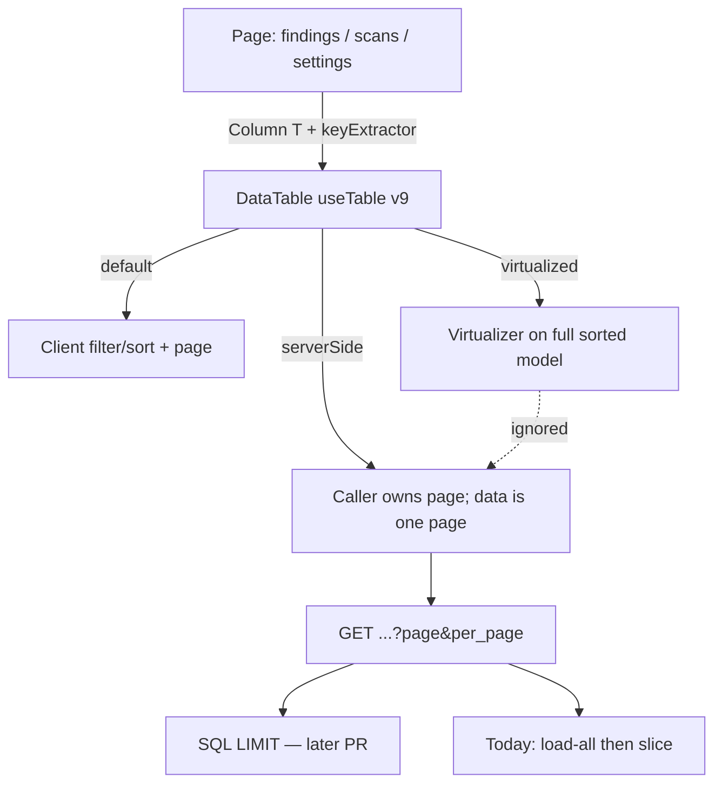

# Elite product plan — Community console, lists, Helm Postgres, AI, Enterprise honesty

| Field | Value |
|---|---|
| Status | Draft |
| Date | 2026-09-04 |
| Scope | `alphabravo-oss/thewolf` (Community) plus a small overlay follow-up in `AlphaBravoCompany/wolf-enterprise` |
| Constraint | Ponytail full. Reuse existing helpers. Land via PR. `main` requires `test` and PRs (`enforce_admins=true`). Overlay CI stays dispatch-only. |
| Out of scope | BSL grant text, signed license SaaS, Cloud billing, Dex, overlay Compose, Cosign issuance, floating scanner tags, mass TanStack Form rewrite |

---

## Overview

Wolf is elite as **scan → cluster → fix → verify** on a laptop or a digest-pinned Helm chart. It is not elite as a fleet console, a Kubernetes database, or a full Enterprise suite.

This plan closes the honesty and reuse gaps that make the product *feel* unfinished:

1. First-hour **New scan** skips the image preflight that **Scan this** uses.
2. TanStack Table (`DataTable`) is the list primitive, but Settings/Account still ship eight raw `<table>`s, and `virtualized` / `serverSide` have **zero call sites**.
3. List APIs advertise `page` / `per_page` / `meta.total` while still loading every row in Go. The UI fetches 200 and paginates locally, so operators can believe they have the full set.
4. Helm `networkPolicy.enabled` defaults **true**, default-deny selects every pod, and **nothing allows ingress to Postgres**. API/worker/fixer also egress TCP 5432 to the whole cluster.
5. Fix engines are real, but Codex is a one-finding prompt and GitHub PR create is fire-and-forget with an empty body.
6. Enterprise SSO is real. Tenancy/catalogs/compliance/residency are name CRUD. Group mappings are stored and never applied on login.

Do this in small PRs. Each PR must be independently mergeable and leave one runnable check.

---

## Background and current state

### What is already elite (do not redo)

| Area | Evidence |
|---|---|
| Edition split | Overlay uses `pkg/edition` / `pkg/control` only. Community UI is baked into the EE image. |
| Scan path | 53 scanners, one suppression matcher (`suppress.ApplyRepo`), 5/3/1, Scorecard on `ghcr.io/ossf/scorecard:v5.5.0` (tag + lock digest, Semgrep-style). |
| List pages | `PageShell` + React Query + `DataTable` (TanStack Table **v9** `useTable` + `tableFeatures()`). |
| Helm control plane | Digest-pinned API/Postgres, no API `docker.sock`, HTTP probes, optional Ingress. |
| Compose Postgres | `POSTGRES_PASSWORD_FILE`, healthcheck, localhost bind, cap-drop. |
| Fix | Claude + OpenCode real; verify gate real; scan/fix SSE real. |
| Overlay SSO | OIDC / SAML / LDAP / SCIM implementations with real libraries. |

### Pain points (inspected)

**UI — TanStack Table underused**

Shared engine: `ui/src/components/ui/data-table.tsx` (ported from Astronomer, adapted to Table v9). Public `Column<T>` + toolbar/search/facet/pagination. Optional `virtualized` (`@tanstack/react-virtual`) and `serverSide` pagination. Neither is passed anywhere.

Already on `DataTable`:

| File | Table |
|---|---|
| `ui/src/routes/_authed.findings.index.tsx` | three views: repo / rule / list |
| `ui/src/routes/_authed.scans.index.tsx` | scan list |
| `ui/src/routes/_authed.scans.$scanId.index.tsx` | scan findings |
| `ui/src/routes/_authed.vulnerabilities.index.tsx` | vulns |
| `ui/src/routes/_authed.coverage.tsx` | coverage |
| `ui/src/routes/_authed.audit.index.tsx` | audit |
| `ui/src/routes/_authed.agents.index.tsx` | agents |
| `ui/src/components/fleet/needs-attention.tsx` | home |
| `ui/src/components/fleet/top-components.tsx` | home |
| `ui/src/components/fixes/scan-agents-panel.tsx` | scan agents |

Hand-rolled `<table className="data-table">` (convert unless noted):

| Location | Surface | Columns (today) |
|---|---|---|
| `_authed.settings.tsx` ~L310 `AdminApiKeysTab` | Settings → API Keys | Owner, Name, Prefix, Scopes, Expires, actions |
| `_authed.settings.tsx` ~L421 `AdminSecretsTab` | Settings → Secrets | Owner, Type, Name, Value (masked), actions |
| `_authed.settings.tsx` ~L502 `AdminNodesTab` | Settings → Nodes | (host/auth/status + actions) |
| `_authed.settings.tsx` ~L728 `AuditTab` | Settings → Audit | duplicate of `/audit` |
| `_authed.settings.tsx` ~L1922 `ApiKeysTab` | Account → API Keys | Name, Prefix, Scopes, Expires, actions |
| `_authed.settings.tsx` ~L2079 `SecretsTab` | Account → Secrets | Type, Name, Value, actions |
| `_authed.settings.tsx` ~L2301 `NodesTab` | Account → Nodes | Name, Host, Auth, Status, actions |
| `_authed.settings.tsx` ~L2629 `UsersTab` | Settings → Users | Email, Role, Created, actions |
| `components/fixes/attempts-table.tsx` ~L113 | Fix job “by scanner” | Scanner, Before, Fixed, Muted, After, Rolled + `<tfoot>` |
| `components/repos/import-github-modal.tsx` ~L256 | GitHub import picker | compact `<Table>` |
| `components/repos/discover-ssh-modal.tsx` ~L265 | SSH discover picker | compact `<Table>` |

`DataTable` traps already documented in-file: `searchValue` must use `sortAccessor` or a primitive `accessor` (ReactNode stringifies to `[object Object]`). v9 requires `RowOf<T> = T & Record<string, any>` internally so call sites keep model interfaces.

**UI — first hour**

`NewScanForm` in `_authed.scans.index.tsx` POSTs `/scans` and navigates to `/scans/$scanId/live`. `useScanWithPreflight` (`components/scan-preflight.tsx`) is used by repo and collection **Scan this** and navigates to `/scans/$scanId`. Empty scans list auto-opens New scan — the path most likely to hit missing images.

**API — pagination theater**

`GET /findings`, `GET /scans`, `GET /scans/:id/findings`, `GET /vulnerabilities` all accept `page` / `per_page` (cap 200; `limit` aliases `per_page` on scans). They load the full set, filter/sort in memory, then slice. `GetScanFindingStats` comment says aggregates without transfer; implementation `ListFindingsByScan`s every row. UI then asks for 200 and paginates in the table.

**Helm Postgres**

`networkPolicy.enabled: true` in `deploy/helm/wolf/values.yaml`. Template `networkpolicy.yaml`: default-deny Ingress+Egress on `podSelector: {}`. API egress to postgres is scoped. **No NetworkPolicy grants ingress to the postgres pod.** Worker/fixer egress TCP 5432 with no `to:` podSelector. Postgres Deployment: readiness only, no resources, no `existingSecret`, DSN `sslmode=disable`.

**AI**

`internal/fix/engine/engine.go` `Codex.Fix` builds a one-line prompt from a single `Finding`. Claude/OpenCode use `FindingsFile`, batch, skip verdicts, progress. `orchestrator.go` ~634 calls `pr.CreateGitHubPR` with only `RepoPath` / `BranchName` / `BaseBranch`. `PRRequest.Findings` / `Category` / `Validation` stay empty, so title is `[Wolf] Fix  issues (0 findings)`. Errors are logged, not surfaced. Relies on ambient `gh` auth in the fixer pod.

**Enterprise**

SSO login: `internal/api/routes/sso.go` JIT from email. `RecordsPanel` at `/enterprise/group-mappings` is never read at login. Sidebar renders every `ui_routes` path from the overlay (`sidebar.tsx` ~94–100), so catalogs/compliance/residency appear as first-class nav.

---

## Goals

1. One scan-start path: New scan and Scan this both go through `useScanWithPreflight`.
2. Every product list of records is a `DataTable` (TanStack Table v9) unless a documented exception (tfoot, tiny modal picker).
3. List UIs never imply a complete set when the API truncated. Prefer server-driven pages; until SQL LIMIT lands, show “showing N of M”.
4. Helm default-deny actually allows API/worker/fixer → Postgres and nothing else on 5432.
5. GitHub PR create has a real body and a visible failure. Codex uses the same `FixRequest` surface as Claude where the CLI allows it.
6. Enterprise nav and SSO match what the binary actually does.

## Non-goals

- Rewrite `DataTable` or downgrade to Table v8.
- Second table wrapper.
- Convert login/register (already TanStack Form) or every settings form to TanStack Form.
- Split `_authed.settings.tsx` “for cleanliness” beyond extracting tables that must become DataTables.
- Floating scanner versions (`:v5`). Bumps stay PRs.
- External Cloud SQL operator, Patroni, overlay image CI on push.
- Making tenancy/ABAC real in this slice — hide or relabel until it scopes data.
- Counsel-owned LICENSE / signed license persist / Cloud billing.

---

## Key decisions

1. **Reuse `DataTable`. Do not call `useTable` at page sites.** Pages pass `Column<T>` + `keyExtractor`. v9 engine stays inside `data-table.tsx`.
2. **Settings AuditTab dies.** `/audit` already uses DataTable. Settings `?tab=audit` redirects there (route already exists: `_authed.audit.tsx` → settings; reverse it so settings audit tab goes to `/audit`, or render the audit route component). One implementation.
3. **`attempts-table` keeps a semantic `<table>` until DataTable grows a footer.** Adding `footer`/`summaryRow` is a separate small PR if we want it; do not block the rest. Document the exception in this file and in the component comment (already there).
4. **GitHub/SSH import modals stay compact `Table` if they are checkbox pickers under ~50 rows with no sort/search.** Convert to DataTable only if they already want search. Read at implementation time; default = keep.
5. **Honesty before SQL.** PR for UI: `serverSide` wired to existing `page`/`per_page`/`meta.total` **and** a visible “Showing X–Y of T” (DataTable already computes `totalRows` from `serverSide.rowCount`). Follow-on PR: SQL `LIMIT`/`OFFSET` + `COUNT` and `GROUP BY` for stats so the 200 cap is a page size, not a silent truncate of an in-memory dump.
6. **Virtualize only full-set tables that can exceed ~100 rows.** Scan findings if we keep a full fetch; fleet list if we keep a full fetch. Do not virtualize agents, coverage, 5-row fleet cards, settings user lists.
7. **`virtualized` and `serverSide` stay mutually exclusive** (already in DataTable: virtualized wins). Scan findings: if we page the API, use `serverSide`. If we fetch all pages client-side for local search, use `virtualized`. Prefer `serverSide` + API search later; do not invent client-side search across pages in this slice.
8. **Helm Postgres NetworkPolicy is a production bug, not polish.** Fix before adding liveness/resources/`existingSecret`.
9. **Enterprise: wire group→role or stop showing the panel as if it works.** Prefer wiring: on SSO JIT, look up records kind `group-mappings` by IdP group name and set `role`. If claims have no groups, leave current email JIT. Hide catalogs/compliance/residency/reports from `UIManifest` until they do more than CRUD (overlay change + pin).
10. **Codex: pass `FindingsFile` / batch prompt when present; keep CLI flags that exist.** Do not fake OpenCode JSON streaming if `codex` does not emit it.
11. **Land Community via PR; pin overlay after each Community SHA** (`PINNED_CORE`, `bootstrap.CommunityCommit`, `packaging.CoreCommit`). Overlay protection stays `enforce_admins=false` until overlay CI is on.



---

## Workstream A — First-hour scan start

**Why:** Empty scans list auto-opens New scan. That path skips image preflight. Repo/collection Scan this does not. First hour is the missing-image path.

### Tasks

- [ ] In `_authed.scans.index.tsx` `NewScanForm`, drop the `useMutation` that `api.post("/scans")`.
- [ ] Call `useScanWithPreflight()` at `ScansPage` (or inside the form) and `scan.launch({ repo_id, branch, tools?, profile? })` on submit.
- [ ] Render `{scan.dialog}` next to the form.
- [ ] Navigate through preflight’s existing success path (`/scans/$scanId`), not `/scans/$scanId/live` (live is a soft redirect).
- [ ] Keep Community-limit toast (`COMMUNITY_LIMIT_COPY`) — already inside preflight.
- [ ] Update `ui/e2e/product.spec.ts` ordinary remote scan: it clicks New scan then Start scan. Preflight may insert a pull dialog when docker_image_management is on; the mock must either report no missing images (current) or accept the dialog. Confirm mock `POST /scans/preflight` still returns `{ missing: [] }`.
- [ ] Manual: empty scans → form open → start → lands on scan detail.

**Check:** existing e2e “starts an API-backed repository scan”.

**PR:** `First-hour New scan uses image preflight`

**Files:** `ui/src/routes/_authed.scans.index.tsx`, maybe `ui/e2e/product.spec.ts`, `ui/e2e/scanner-api-mock.ts`.

---

## Workstream B — TanStack Table everywhere it belongs

**Why:** User asked to use TanStack Table as much as possible. The wrapper already exists. Settings is the largest holdout. Unused `serverSide`/`virtualized` are why large lists feel fake.

### B0 — DataTable call-site contract (no engine rewrite)

When converting a table:

```tsx
<DataTable
  data={rows}
  columns={columns}
  keyExtractor={(r) => r.id}
  loading={q.isLoading}
  isError={q.isError}
  onRetry={() => void q.refetch()}
  emptyMessage="…"
  searchPlaceholder="…"
  persistKey="wolf-settings-users" // admin tables only
  density="compact" // settings/account
/>
```

Every column that should search/sort/facet needs `sortAccessor` returning a scalar (see `searchValue` in `data-table.tsx`). Action buttons live in an `accessor` cell; column `sortable={false}`.

Do not pass `virtualized` and `serverSide` together.

### B1 — Settings admin tables

File: `ui/src/routes/_authed.settings.tsx` (leave file split as optional follow-on).

- [ ] **AdminApiKeysTab (~L310):** DataTable. Columns: Owner (`sortAccessor` email), Name, Prefix, Scopes (join), Expires, actions (revoke). `persistKey="wolf-admin-apikeys"`. Confirm dialog stays outside the table (existing `pending` state).
- [ ] **AdminSecretsTab (~L421):** DataTable. Owner, Type, Name, Value (existing mask), delete. `persistKey="wolf-admin-secrets"`. Values remain masked; do not add a reveal column.
- [ ] **AdminNodesTab (~L502):** DataTable. Match current columns. `persistKey="wolf-admin-nodes"`.
- [ ] **UsersTab (~L2629):** DataTable. Email, Role (keep demote lock: last admin / self — disable control in cell, do not hide the row), Created, delete. `persistKey="wolf-settings-users"`. `NewUserForm` stays above the table.
- [ ] Delete local loading/empty `<div className="p-5">` once DataTable `loading` / `emptyMessage` cover them.
- [ ] Do not selectable on these (no bulk revoke in this slice).

### B2 — Account personal tables (same file, exported to `_authed.account.tsx`)

- [ ] **ApiKeysTab (~L1922):** DataTable. Name, Prefix, Scopes, Expires, revoke. `persistKey` omit or `wolf-account-apikeys`.
- [ ] **SecretsTab (~L2079):** DataTable. Type, Name, Value, delete. Create form stays above.
- [ ] **NodesTab (~L2301):** DataTable. Name, Host, Auth, Status, actions.

### B3 — Duplicate audit

- [ ] Remove `AuditTab` table and its local sort/filter/pager/SeverityBadge.
- [ ] Settings `tab=audit`: `redirect({ to: "/audit" })` in `beforeLoad` **or** render the audit route component. Prefer redirect so there is one URL.
- [ ] Keep `/audit` → settings redirect only if we invert: today `_authed.audit.tsx` redirects **to** settings. Change that file to be the real page (it already is `_authed.audit.index.tsx`?) — inspect: `_authed.audit.tsx` redirects to settings; `_authed.audit.index.tsx` is a full DataTable page. Sidebar already links to `/audit`. **Delete settings AuditTab and the redirect in `_authed.audit.tsx`** so `/audit` is canonical. Settings tab “Audit” `navigate({ to: "/audit" })`.

### B4 — Honest list pages (Community fleet)

API already returns `meta.total`. UI ignores it.

- [ ] **Scan findings** (`_authed.scans.$scanId.index.tsx`): stop treating `per_page=200` as “the scan”. Wire `serverSide`: `rowCount` from `r.meta.total`, `pagination` in component state, `onPaginationChange` updates page and refetch. Query key includes page/per_page. Default `per_page` 50 (API default) or 100 — not 200 unless needed. Show toolbar note if `total > data.length`.
- [ ] **Fleet findings list view** (`_authed.findings.index.tsx` list): same `serverSide` using `GET /findings`.
- [ ] **Scans index:** already `limit=200`. Switch to `page`/`per_page` + `serverSide`. Keep `limit` alias on the server.
- [ ] **Vulnerabilities index:** same.
- [ ] Do **not** enable `virtualized` on these once they are server-paged (would ignore serverSide).
- [ ] Repo/rule aggregate views on findings: keep client DataTable (aggregates are small). If they are built from the capped list, document that they use the same fetch as list view or a dedicated aggregate endpoint (`/findings/stats` / fleet helpers). Do not silently aggregate a 200-row sample and call it fleet posture — if that is today’s behavior, either fetch aggregates from `useFindingsByRepo` (already a dedicated hook) and leave those tables client-side.

### B5 — Exceptions (document, do not convert in this slice)

| Table | Reason | Revisit |
|---|---|---|
| `attempts-table.tsx` | `<tfoot>` totals; DataTable has no footer | Optional `footer` prop PR |
| Import GitHub / Discover SSH modals | Tiny selection grids | Convert if search is added |
| Scanner inventory cards on Settings → Scanners | Not a table | Leave |

### B6 — Optional DataTable footer (only if attempts-table conversion is wanted)

- [ ] Add optional `footer?: ReactNode` **or** `summaryRow?: T` rendered as one extra row after body.
- [ ] Convert `attempts-table.tsx`.
- [ ] Skip if the prop is more than ~30 lines. Exception stays.

**Checks:** `pnpm typecheck`, `pnpm lint`, `pnpm test:e2e` (settings scanners visual will change if Settings chrome is untouched — table swaps inside tabs should not shift `scanner-settings-inventory.png` unless the Scanners tab layout changes). Update baselines only if pixels change.

**PRs:**

1. `Use DataTable for Settings and Account record lists` (B1, B2)
2. `Make /audit the only audit table` (B3)
3. `Server-page findings, scans, and vulnerabilities in DataTable` (B4)

---

## Workstream C — SQL pagination (partner to B4)

**Why:** `serverSide` without SQL still loads the fleet into the API process. The UI becomes honest; the server stays slow. Do C after B4 so query params are already real.

### Tasks

- [ ] `ListFindings` (`internal/api/routes/findings.go`): replace `gatherUserFindings` + in-memory filter with store methods that `WHERE` + `ORDER BY` + `LIMIT/OFFSET` and a matching `COUNT(*)`. Preserve suppress drop (`applyPathSuppressionsForFindings` / `dropSuppressed`) — **apply suppressions in SQL or in a subquery**, not by loading all then dropping. If suppression cannot move into SQL in one PR, keep post-filter but **paginate after drop** and set `meta.total` to the post-filter count (today’s semantics), then a follow-up pushes suppressions down. Do not change which rows are visible.
- [ ] `GetScanFindings` (`scans.go` ~1696): same for one scan.
- [ ] `GetScanFindingStats`: `GROUP BY severity` / `tool_name` in SQL. Delete the load-all loop.
- [ ] `ListScans`: SQL filter `repo_id`/`status` + page. Kill N+1 `GetRepoByID` (join or batch).
- [ ] `ListVulnerabilities`: same pattern as findings.
- [ ] Tests: `scans_test.go` already hits `page=abc&per_page=-1`. Add: `per_page` cap 200; total > per_page returns page 2 disjoint from page 1; stats match listed counts on a fixture scan.
- [ ] SQLite and Postgres stores both get the new queries (`internal/db/sqlite.go`, `postgres.go`). No “postgres only” pagination.

**Check:** `go test ./internal/api/routes ./internal/db -count=1`.

**PR:** `Paginate findings, scans, and stats in SQL`

**Files:** `internal/api/routes/{findings,scans,vulnerabilities}.go`, `internal/db/{store,sqlite,postgres,fleet_current}.go`, tests.

---

## Workstream D — Helm Postgres NetworkPolicy (and only the NP)

**Why:** `networkPolicy.enabled` defaults true. Default-deny is on every pod. Postgres has no ingress allow. This is a cluster-outage for the bundled DB, not a hardening nice-to-have.

### Tasks

- [ ] Add `NetworkPolicy` `{{ include "wolf.fullname" . }}-postgres`:
  - `podSelector`: `app.kubernetes.io/component: postgres`
  - `policyTypes: [Ingress, Egress]`
  - Ingress: from pods with component `api`, `scan-worker`, `fixer` (and scanner-release workers that already talk to PG if any — grep chart for 5432) port 5432 TCP only.
  - Egress: none, or DNS if the image needs it (official postgres typically none).
- [ ] Tighten worker/fixer (and custom-build if it uses PG) **5432 egress** to `podSelector` postgres, matching API.
- [ ] `tests/render-security.sh`: default render contains postgres ingress from api; worker 5432 is not a port-only all-destinations rule (grep that CIDR-less 5432 is only in a `to: podSelector` block). Fail if postgres NP missing when `networkPolicy.enabled` is true.
- [ ] Do **not** in this PR: liveness, resources, `existingSecret`, `sslmode`, fixer image digest. Those are Workstream H.

**Check:** `make helm-validate`

**PR:** `Allow Helm Postgres ingress only from Wolf components`

**Files:** `deploy/helm/wolf/templates/networkpolicy.yaml`, `deploy/helm/wolf/tests/render-security.sh`

---

## Workstream E — DRY chrome (small, ride along)

**Why:** Duplicate badges and dead empty-state components make Settings conversions messier.

### Tasks

- [ ] Delete `_authed.settings.tsx` local `SeverityBadge` (~L583). Import `components/severity-badge.tsx` or `lib/severity.ts` `severityBadgeClass`.
- [ ] Point `components/fixes/status-badge.tsx` at `components/ui/status-badge.tsx` with a status→variant map, or delete the fix copy if the UI one already covers fix job states.
- [ ] Replace copied `SEVERITY_RANK` objects in findings/scan/vuln pages with `severityRank` from `lib/severity.ts`.
- [ ] Use `PermissionState` from `empty-state.tsx` on audit 403. Leave a grand ErrorState migration as skip.

**PR:** fold into B1 or a tiny `Share severity and status badges`. Prefer folding into B1 to avoid a badges-only PR.

---

## Workstream F — Fix engine honesty

**Why:** PR create is called and ignored. Codex does not use the request the orchestrator already builds for other engines.

### F1 — GitHub PR body and errors

- [ ] In `orchestrator.go` after successful push, populate `PRRequest.Findings` (kept findings), `Category`, `Validation` from the verify summary.
- [ ] Persist `prRes.URL` on the job if a column/JSON field exists; if not, log + set a user-visible `PauseReason` / job field already used for push SHA. Grep `PushSHA` / job model before adding a column.
- [ ] If `prRes.Error != ""`, do not swallow: set pause/reason `pr_create_failed` and keep the branch (same as push failure).
- [ ] Document that `gh` must be authenticated in the fixer image (existing secret / `GH_TOKEN`). Do not add a new OAuth app.

### F2 — Codex parity (lazy)

- [ ] If `req.FindingsFile != ""`, point Codex at that file in the prompt instead of one `Finding`.
- [ ] If `req.Findings` is non-empty, mention count + first N titles.
- [ ] Keep `--approval-mode full-auto --quiet`. Do not invent JSON streaming.
- [ ] Share skip/empty-success behavior with the existing “judge by worktree” comment.

**Check:** `go test ./internal/fix/...`

**PR:** `Surface GitHub PR create and give Codex the batch prompt`

**Files:** `internal/fix/orchestrator/orchestrator.go`, `internal/fix/pr/pr.go`, `internal/fix/engine/engine.go`, job model if a URL field is missing.

---

## Workstream G — Enterprise honesty

**Why:** SSO is real. The rest of the EE nav looks like a product and is a `RecordsPanel`.

### G1 — Group mappings actually change role (overlay + Community SSO)

- [ ] Define the record shape (already name = IdP group). Add a **role** field if missing (`admin` \| `user`). Reject unknown roles at write (`entapi` / control).
- [ ] On SSO callback (`thewolf/internal/api/routes/sso.go`), after email JIT, if the IdP provided groups (OIDC `groups` / SAML attribute / LDAP memberOf — read what identity already puts on the auth result), look up mappings via `control.Records` kind `group-mappings` and set the user’s role. Last matching mapping wins, or most-privileged wins — pick **most-privileged** (`admin` over `user`) and document it.
- [ ] If no groups claim, keep email JIT role (do not demote existing admins).
- [ ] Test: mapping `eng` → `user`, `admins` → `admin`; user in both becomes admin.

**PR:** overlay `wolf-enterprise` for mapping schema if needed + Community SSO consume. May be two PRs (Community hook first with a small `pkg/control` read, overlay stores the records).

### G2 — Hide unfinished modules from nav

- [ ] Overlay `UIManifest` for catalogs, compliance, reports, residency, customer-keys: return empty or omit from sidebar until they do more than CRUD. Keep routes working if bookmarked (RecordsPanel is fine as a hidden admin URL).
- [ ] Keep Identity, Tenancy (until G3), Integrations (SIEM/ticketing send is real), Support/diagnostics, Packaging.
- [ ] Tenancy: either a one-line UI copy “logical labels only; scans are not scoped yet” or hide. **Do not implement ABAC in this plan.**

**PR:** `Hide unfinished Enterprise nav` in overlay; pin Community if UI copy lives in public routes.

---

## Workstream H — Later (do not start until A–D land)

| Item | Why later |
|---|---|
| Helm postgres liveness, resources, `existingSecret`, `sslmode` | NP is the outage; this is hardening |
| Helm `postgres.enabled=false` + external DSN | Real “cloud native PG”; new values/schema/tests |
| Compose `postgres:16-alpine` digest | Laptop profile; mutable tag is acceptable |
| Helm fixer image digest | Separate from API pin |
| DataTable `footer` + attempts-table | Exception is honest |
| Settings file split into `components/settings/*` | Only if B1 makes the file worse |
| TanStack Form on settings | Login/register only; YAGNI |
| Overlay image CI on push | Still dispatch-only by request |
| Deduplicate `PINNED_CORE` triple | Process, not product |

---

## Rollout

- One workstream per PR (A, B1+B2, B3, B4, C, D, F, G2, G1).
- Community: branch → PR → wait for check `test` → merge without `--admin`.
- Overlay: pin `PINNED_CORE` + `bootstrap.CommunityCommit` + `packaging.CoreCommit` after each Community SHA that overlay compiles against. Direct overlay push still admin-bypasses `test` until overlay CI is enabled — do not tighten overlay protection.
- Rollback: revert the PR. Helm NP revert restores previous (broken) policies; call that out in the PR body.
- No feature flags. These are bugfixes and reuse.

---

## Security and privacy

- Secrets tables: keep masked values; DataTable search must `sortAccessor` on name/type, **not** the masked secret string if that string is a constant `••••`.
- Admin token list: hash-only; do not add a secret column.
- Postgres NP: do not add ingress from `podSelector: {}`.
- SSO role mapping: never take a role string from the IdP unchecked; only mapped Wolf roles.
- PR body: do not dump secret findings into GitHub if the existing `buildPRBody` already redacts; read it before changing.

---

## Observability

- No new metrics. Scan start failures already toast. PR create failures become job pause reasons (F1).
- Helm: `make helm-validate` is the check.
- UI: Playwright product + ease specs; update screenshots only when Settings scanners tab pixels change (they should not).

---

## Risks

| Risk | Severity | Mitigation |
|---|---|---|
| DataTable search on ReactNode columns matches nothing / everything | Medium | Always set `sortAccessor` (existing comment in `data-table.tsx`) |
| Settings e2e screenshot drift | Low | Do not change Scanners tab layout in B1 |
| SQL pagination changes which rows are visible vs in-memory suppress | High | Tests comparing pre/post counts on a fixture with `.wolfignore` |
| Postgres NP too tight (release workers need 5432) | High | Grep chart for 5432 before merging D |
| SSO mapping demotes break-glass admin | High | No groups claim → no role change; most-privileged wins |
| Codex CLI rejects long prompts | Low | File path in prompt, not inline dump |
| Virtual+serverSide footgun | Low | Already ignored in DataTable; do not pass both |

---

## Alternatives considered

1. **Rewrite DataTable to v8 `useReactTable`.** Rejected. v9 is installed and working. Astronomer port notes live in the file header.
2. **Call `useTable` in every page.** Rejected. Duplicates feature registration and the `RowOf` workaround.
3. **Fetch all pages in the client and virtualize.** Works for one scan; blows up for fleet findings. Prefer `serverSide` + SQL.
4. **Disable Helm NetworkPolicy by default.** Hides the postgres bug. Fix the policy instead.
5. **Implement tenancy scoping now.** Too large; honesty (hide/label) first.
6. **Float Scorecard `:v5`.** Rejected earlier; tag mutation and parser contract. Bump PRs only.

---

## Open questions

None blocking implementation. Defaults above:

- attempts-table stays an exception.
- Import/SSH modals stay compact Table.
- Most-privileged group mapping.
- `/audit` becomes canonical; settings tab navigates there.

If product wants attempts-table on DataTable, do B6 as its own PR.

---

## PR Plan

Ordered. Each is mergeable alone.

| # | Title | Depends | Files | What |
|---|---|---|---|---|
| 1 | First-hour New scan uses image preflight | — | `ui/src/routes/_authed.scans.index.tsx`, e2e mock if needed | Workstream A |
| 2 | Use DataTable for Settings and Account record lists | — | `_authed.settings.tsx`, maybe `severity-badge` imports | B1, B2, E |
| 3 | Make `/audit` the only audit table | 2 nice-to-have | `_authed.settings.tsx`, `_authed.audit.tsx` | B3 |
| 4 | Server-page findings, scans, and vulnerabilities in DataTable | — | findings/scans/vulns routes, `data-table` call sites | B4 |
| 5 | Paginate findings, scans, and stats in SQL | 4 | `internal/api/routes/*`, `internal/db/*` | C |
| 6 | Allow Helm Postgres ingress only from Wolf components | — | `networkpolicy.yaml`, `render-security.sh` | D |
| 7 | Surface GitHub PR create and give Codex the batch prompt | — | `internal/fix/**` | F |
| 8 | Hide unfinished Enterprise nav | — | overlay `UIManifest`s, maybe public route copy | G2 |
| 9 | Apply SSO group mappings to Wolf roles | 8 optional | `sso.go`, overlay identity/records | G1 |

After 1–6: pin overlay to the Community merge SHA.

Do not combine 4+5 in one PR if the SQL diff is large; ship honest UI first.

---

## Granular execution order for the assignee

1. PR1 preflight (smallest user-visible honesty).
2. PR6 Helm NP (smallest production outage). Can parallel PR1.
3. PR2 DataTable settings/account.
4. PR3 audit URL.
5. PR4 serverSide lists.
6. PR5 SQL.
7. PR7 fix/PR/Codex.
8. PR8 then PR9 Enterprise.

---

## References

- `ui/src/components/ui/data-table.tsx` — v9 engine, `virtualized`, `serverSide`, `searchValue`
- `ui/src/components/scan-preflight.tsx` — `useScanWithPreflight`
- `internal/api/routes/findings.go`, `scans.go`, `vulnerabilities.go` — page/per_page
- `deploy/helm/wolf/templates/networkpolicy.yaml`, `values.yaml` `networkPolicy.enabled`
- `internal/fix/engine/engine.go` Codex, `internal/fix/pr/pr.go`, `orchestrator.go`
- `ui/src/routes/_authed.enterprise.identity.tsx` group-mappings panel
- `ui/src/components/layout/sidebar.tsx` `ui_routes` nav
- Prior ranking: Community 1–7 (matcher, first-hour Scan this, 409 copy, Settings tabs, Ingress, breadcrumbs, required `test`) already landed
